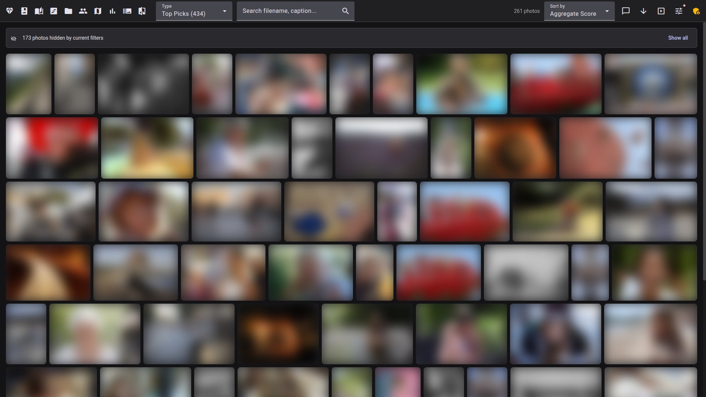

# Facet

> 🌐 [English](README.md) · [Français](README.fr.md) · [Deutsch](README.de.md) · [Italiano](README.it.md) · **Español**

Facet es un motor local de análisis y selección de fotos. Puntúa cada imagen en 9 dimensiones —desde la calidad estética hasta la nitidez del rostro— y luego te permite explorar, seleccionar y organizar a través de una galería web. Todo se ejecuta en tu máquina; sin nube, sin cuentas y sin claves de API.


<p align="center">
  
</p>

## Cómo funciona

1. **Escanear** — Apunta Facet a una carpeta de fotos. Cada imagen se analiza en cuanto a calidad, composición y rostros. Admite JPG, HEIF/HEIC y 10 formatos RAW (CR2, CR3, NEF, ARW, RAF, RW2, DNG, ORF, SRW, PEF).
2. **Explorar** — Abre la galería web para recorrer tu biblioteca con filtros, búsqueda y varios modos de visualización.
3. **Seleccionar** — Facet detecta ráfagas, marca parpadeos, agrupa fotos similares y destaca la mejor selección.

La GPU se detecta automáticamente y es opcional. Facet funciona solo con CPU o con hasta 24 GB de VRAM.

## Funcionalidades

### Puntuar

Cada foto se puntúa en 9 dimensiones: calidad estética, composición, calidad facial, nitidez ocular, nitidez técnica, color, exposición, saliencia del sujeto y rango dinámico. Las fotos se clasifican por contenido (retrato, paisaje, macro, callejera, etc. —más de 30 categorías) y se puntúan con pesos específicos por categoría. Un filtro de **Selección destacada** clasifica la biblioteca según una puntuación combinada.

Pasa el cursor sobre cualquier foto para ver un tooltip con el desglose de la puntuación y los datos EXIF.


### Seleccionar

- **Detección de ráfagas** — agrupa las tomas en serie y selecciona automáticamente la mejor según la nitidez, la calidad y la detección de parpadeos
- **Grupos de similitud** — encuentra fotos visualmente similares en toda la biblioteca, sin importar cuándo se tomaron
- **Escenas** — agrupa una sesión en "escenas" cronológicas según los intervalos entre tomas, para seleccionar en orden narrativo; toca para marcar y confirma para rechazar
- **Insignias por rostro en la selección** — el visor de selección muestra insignias por cada rostro (ojos abiertos/cerrados, expresión, confianza de detección) en lugar de una única marca de parpadeo a nivel de foto
- **Detección de parpadeos** — marca las tomas con ojos cerrados para ocultarlas o rechazarlas con un solo clic
- **Detección de duplicados** — identifica imágenes casi idénticas mediante hashing perceptual

<table><tr>
<td></td>
<td></td>
</tr></table>

### Explorar

- **Modos de galería** — mosaico (filas justificadas que preservan las proporciones) y cuadrícula (tarjetas uniformes con superposición de metadatos)
- **Filtros** — rango de fechas, etiqueta de contenido, patrón de composición, cámara, objetivo, persona, nivel de calidad, valoración por estrellas y rangos de métricas personalizados
- **Búsqueda semántica** — escribe una consulta en lenguaje natural como "atardecer en la playa" y encuentra fotos coincidentes mediante búsqueda por embedding y por texto
- **Cronología** — explorador cronológico con navegación por año/mes y desplazamiento infinito
- **Mapa** — fotos geoetiquetadas en un mapa interactivo con agrupación de marcadores
- **Cápsulas** — pases de diapositivas temáticos: viajes con nombres de lugares, colección dorada, paletas estacionales, fotos de una persona y mucho más
- **Carpetas** — explora por estructura de directorios con navegación de migas de pan y fotos de portada
- **Recuerdos** — "En este día": fotos de la misma fecha en años anteriores
- **Pase de diapositivas** — modo de pantalla completa con transiciones temáticas, encadenamiento automático entre cápsulas y controles de teclado

<table><tr>
<td></td>
<td></td>
</tr></table>

<details><summary>Barra lateral de filtros — todas las secciones desplegadas (haz clic para ver)</summary>
<p align="center"></p>
</details>

**Consejos de flujo de trabajo:**
- Para una revisión cronológica de un viaje o un año, abre **`/timeline`** — ordena por puntuación global para recorrer las mejores tomas de un día, o avanza mes a mes.
- La vista **`/capsules`** genera diaporamas temáticos (viajes, "Rostros de", estacionales, dorados) que puedes guardar como álbumes.
- La galería oculta por defecto los parpadeos, las ráfagas no principales y los duplicados. Cuando aparezca el aviso **"N fotos ocultas por los filtros actuales"**, haz clic en "Mostrar todas" para ampliar la vista.

### Organizar

- **Reconocimiento facial** — detección automática de rostros, agrupación en personas y detección de parpadeos. Busca, renombra, fusiona y organiza los grupos de personas desde la interfaz de gestión. Las **sugerencias de fusión** encuentran grupos de aspecto similar que podrían ser la misma persona.
- **Álbumes** — colecciones manuales con arrastrar y soltar, o álbumes inteligentes que se rellenan automáticamente a partir de combinaciones de filtros guardadas
- **Valoraciones y favoritos** — valoraciones por estrellas (1–5), favoritos y marcas de rechazo. Recorre las valoraciones con un solo clic.
- **Etiquetas** — etiquetas de contenido generadas por IA con vocabulario configurable. Haz clic en cualquier etiqueta para filtrar la galería.
- **Operaciones por lotes** — selección múltiple con Mayús+clic, Ctrl+clic o Ctrl+A (seleccionar todo). Asigna valoraciones, alterna favoritos, marca rechazos o añade a álbumes de forma masiva, con 7 segundos para deshacer cada acción por lotes.
- **Prioridad al teclado** — las teclas de flecha navegan por la galería, Intro abre, Espacio selecciona; pulsa `?` en cualquier lugar para ver la referencia de atajos.


<table><tr>
<td></td>
<td></td>
</tr></table>

### Comprender

- **Estadísticas** — paneles de uso de equipo, desglose por categoría, cronología de disparos y correlaciones de métricas
- **Crítica con IA** — desglose de la puntuación que muestra la contribución de cada métrica; evaluación en lenguaje natural por VLM `[GPU]` `[16gb/24gb]`
- **Ajuste de pesos** — editor de pesos por categoría con vista previa de la puntuación en vivo. La comparación A/B de fotos aprende de tus elecciones y sugiere pesos optimizados.
- **Orden "Mi gusto"** — ordena la galería según la puntuación aprendida del clasificador personal, con una insignia de confianza que muestra la cobertura aprendida y la precisión en datos de validación
- **Aprendizaje a partir de etiquetas** — las decisiones de selección, las valoraciones por estrellas, los favoritos y los rechazos alimentan el optimizador de pesos (`--sync-label-comparisons`, `--mine-insights`)
- **Instantáneas** — guarda, restaura y compara configuraciones de pesos
- **Histograma** — histograma de luminancia en el tooltip de la foto y en la vista de detalle
- **Leyendas con IA** `[GPU]` `[16gb/24gb]` `[Edition]` — descripciones de texto, editables y traducibles a 5 idiomas

<table><tr>
<td></td>
<td></td>
</tr></table>

<table><tr>
<td></td>
<td></td>
</tr></table>

<table><tr>
<td></td>
<td></td>
</tr></table>

<table><tr>
<td></td>
<td></td>
</tr></table>

### Compartir

- **Compartir álbumes** — genera enlaces para compartir cualquier álbum, sin que los destinatarios necesiten iniciar sesión. Revoca el acceso en cualquier momento.
- **Descarga de fotos** — descarga fotos individuales o selecciones desde la galería
- **Exportar** — exporta todas las puntuaciones a CSV o JSON para análisis externo

### Más

- **Modo oscuro y claro** con 10 temas de color de acento; respeta la preferencia del sistema
- **Adaptable** — se adapta del móvil al escritorio, con una hoja de acciones masivas táctil en pantallas pequeñas
- **PWA instalable** — manifiesto de aplicación web + service worker: instálala en la pantalla de inicio, shell de la aplicación sin conexión, miniaturas en caché
- **Galería virtualizada** — renderiza un puñado de nodos del DOM independientemente del tamaño de la biblioteca, de modo que el desplazamiento sigue siendo rápido con más de 100.000 fotos
- **Escaneos reanudables** — los escaneos interrumpidos se reanudan (`--resume`), los archivos fallidos se registran y se pueden reintentar (`--retry-failed`), y el progreso se transmite a la interfaz web
- **5 idiomas** — inglés, francés, alemán, español, italiano
- **Multiusuario** — directorios, valoraciones y acceso por roles para cada usuario
- **Plugins y webhooks** — acciones personalizadas activadas por eventos de puntuación
- **Escaneo desde la interfaz web** — inicia escaneos desde el navegador (rol de superadministrador)

<table><tr>
<td width="33%"></td>
<td width="33%"></td>
<td width="33%"></td>
</tr></table>

## Disponibilidad y requisitos de las funciones

La mayor parte de Facet funciona en cualquier entorno (CPU, cualquier perfil). Algunas funciones necesitan una GPU, un **perfil de VRAM** superior, un paquete opcional o la **contraseña de edición** / el rol de **superadministrador** del visor. Etiquetas usadas a lo largo de la documentación:
`[GPU]` · `[16gb/24gb]` (perfil de VRAM) · `[Edition]` · `[Superadmin]` · `[Optional: pkg]`.

| Función | GPU | Perfil | Autenticación | Paquete opcional |
|---------|:---:|---------|:----:|------------------|
| Puntuación / escaneo (base) | opcional | cualquiera (`legacy` = CPU) | — | — |
| Estética TOPIQ | sí | `16gb`/`24gb` | — | — |
| IQA suplementario (TOPIQ IAA, NR-Face, LIQE) | sí | `8gb`/`16gb`/`24gb` | — | — |
| Embeddings SigLIP 2 | sí | `16gb`/`24gb` | — | — |
| Etiquetado VLM (Qwen3.5) | sí | `16gb`/`24gb` | — | — |
| Patrón de composición (SAMP-Net) | opcional | cualquiera (`legacy` = CPU) | — | — |
| Composición (Qwen2-VL) | sí | `24gb` | — | — |
| Saliencia del sujeto (BiRefNet) | sí | `16gb`/`24gb` | — | — |
| Leyendas con IA | sí | `16gb`/`24gb` | edición | — |
| Crítica VLM | sí | `16gb`/`24gb` | — | — |
| Detección / extracción de rostros (InsightFace) | recomendada (la CPU funciona, pero es lenta) | cualquiera | — | — |
| Agrupación de rostros (HDBSCAN) | no (CPU) | cualquiera | — | `cuml`/`cupy` (aceleración GPU opcional) |
| Búsqueda semántica | no | cualquiera | — | `sqlite-vec` (recurre a NumPy) |
| Decodificación RAW / HEIF | no | cualquiera | — | `rawpy` / `pillow-heif` |
| Modo de vigilancia (`--watch`) | no | cualquiera | — | `watchdog` |
| Extracción de GPS / exportación a darktable | no | cualquiera | — | `exiftool` / `darktable-cli` |
| Valoraciones, favoritos, edición de rostros y personas, selección | no | cualquiera | edición | — |
| Iniciar escaneos desde la interfaz web | no | cualquiera | superadministrador | — |
| Multiusuario (valoraciones y roles por usuario) | no | cualquiera | basada en roles | — |

> La *agrupación* de rostros se ejecuta en CPU por defecto (`hdbscan` independiente); `cuml`/`cupy` solo añaden aceleración GPU opcional —**no** son obligatorios. La contraseña de edición y los roles de usuario se configuran en `scoring_config.json`. Consulta [Instalación](docs/es/INSTALLATION.md) para los paquetes opcionales y [Configuración](docs/es/CONFIGURATION.md) para la autenticación.

## ¿Es Facet para ti?

Facet puntúa, clasifica y selecciona una biblioteca de fotos local y sirve una galería para explorarla. Se ejecuta en tu propio hardware y mantiene las fotos fuera de la nube.

**Encaja bien si:**

- tienes una biblioteca local grande y quieres encontrar tus mejores tomas y descartar ráfagas y casi duplicados;
- quieres una puntuación de calidad, composición y rostros que puedas ajustar a tu propio gusto (aprende de tus comparaciones A/B);
- prefieres lo autoalojado y privado: sin subida a la nube, sin cuenta, sin suscripción;
- ya editas en Lightroom o darktable: Facet escribe las valoraciones, etiquetas de color y etiquetas de vuelta como sidecars XMP.

**Probablemente no sea para ti si quieres:**

- un sustituto de Google Photos llave en mano, móvil y respaldado en la nube, con copia de seguridad automática del teléfono;
- edición o revelado RAW: Facet puntúa y organiza, no edita;
- una aplicación de escritorio sin configuración: necesita Python, y los mejores modelos necesitan una GPU.

**Cómo se relaciona con otras herramientas**

- Las bibliotecas autoalojadas (Immich, PhotoPrism) se centran en organizar, buscar y respaldar. Facet añade puntuación de calidad, clasificación y un flujo de trabajo de selección que ellas no tienen, pero carece de aplicación móvil o de copia de seguridad/sincronización integrada.
- Las aplicaciones de selección con IA (Aftershoot, Narrative, FilterPixel) son seleccionadores comerciales pulidos, a menudo con edición integrada. Facet es gratuito, local, más amplio (galería, búsqueda, rostros) y su puntuación es ajustable, pero es un proyecto de un solo desarrollador sin su soporte ni edición RAW.
- Los editores y catálogos (Lightroom, darktable, digiKam) revelan y gestionan fotos. Facet los complementa mediante la exportación XMP en lugar de reemplazarlos.

La puntuación estética se basa en modelos y es aproximada; cuenta con ajustar los pesos para adaptarlos a tu gusto.

## Inicio rápido

### Docker (recomendado)

```bash
docker compose up
# Abre http://localhost:5000
```

Esto se ejecuta en modo CPU: no se necesita GPU para explorar y servir una biblioteca existente. Monta tu directorio de fotos en `docker-compose.yml`.

La **aceleración por GPU** (opcional) requiere una GPU NVIDIA y el [NVIDIA Container Toolkit](https://docs.nvidia.com/datacenter/cloud-native/container-toolkit/install-guide.html). Actívala con el archivo de anulación:

```bash
docker compose -f docker-compose.yml -f docker-compose.gpu.yml up
```

### Instalación manual

```bash
git clone https://github.com/ncoevoet/facet.git && cd facet
bash install.sh          # detecta automáticamente la GPU, crea el venv e instala todo

source venv/bin/activate         # macOS/Linux
# .\venv\Scripts\Activate.ps1    # Windows PowerShell

python facet.py /photos  # puntuar fotos
python viewer.py         # iniciar el visor web → http://localhost:5000
```

> **macOS:** el receptor de AirPlay del Centro de Control ocupa el puerto 5000 por defecto. Si ves "Address already in use", ejecuta `python viewer.py --port 5001`.

El script de instalación detecta automáticamente tu versión de CUDA, instala la variante correcta de PyTorch, compila el frontend de Angular y verifica todas las importaciones. Opciones: `--cpu` (forzar CPU), `--cuda 12.8` (anular la versión de CUDA), `--skip-client` (omitir la compilación del frontend).

<details>
<summary>Instalación manual paso a paso</summary>

```bash
# 1. Instalar exiftool (opcional pero recomendado)
# Ubuntu/Debian: sudo apt install libimage-exiftool-perl
# macOS:         brew install exiftool

# 2. Crear el entorno virtual
python -m venv venv && source venv/bin/activate

# 3. Instalar PyTorch con CUDA (elige tu versión en https://pytorch.org/get-started/locally)
pip install torch torchvision --index-url https://download.pytorch.org/whl/cu128

# 4. Instalar las dependencias de Python (todas a la vez — consulta Solución de problemas si encuentras conflictos)
pip install -r requirements.txt

# 5. Instalar ONNX Runtime para la detección facial (elige UNO)
pip install onnxruntime-gpu>=1.17.0   # GPU (CUDA 12.x)
# pip install onnxruntime>=1.15.0     # CPU fallback

# 6. Compilar el frontend de Angular
cd client && npm install && npx ng build && cd ..

# 7. Puntuar fotos e iniciar el visor
python facet.py /path/to/photos
python viewer.py
```
</details>

Ejecuta `python facet.py --doctor` para diagnosticar problemas con la GPU. Consulta [Instalación](docs/es/INSTALLATION.md) para los perfiles de VRAM, los paquetes de etiquetado VLM (16gb/24gb), las dependencias opcionales y la [resolución de conflictos de dependencias](docs/es/INSTALLATION.md#troubleshooting-dependency-conflicts).

## Documentación

| Documento | Descripción |
|----------|-------------|
| [Instalación](docs/es/INSTALLATION.md) | Requisitos, configuración de GPU, perfiles de VRAM, dependencias |
| [Comandos](docs/es/COMMANDS.md) | Referencia de todos los comandos de la CLI |
| [Configuración](docs/es/CONFIGURATION.md) | Referencia completa de `scoring_config.json` |
| [Puntuación](docs/es/SCORING.md) | Categorías, pesos, guía de ajuste |
| [Reconocimiento facial](docs/es/FACE_RECOGNITION.md) | Flujo de trabajo de rostros, agrupación, gestión de personas |
| [Visor](docs/es/VIEWER.md) | Funciones y uso de la galería web |
| [Despliegue](docs/es/DEPLOYMENT.md) | Despliegue en producción (NAS Synology, Linux, Docker) |
| [Contribuir](CONTRIBUTING.md) | Configuración de desarrollo, arquitectura, estilo de código |

## Licencia

[MIT](LICENSE)
