# Facet

> 🌐 [English](README.md) · **Français** · [Deutsch](README.de.md) · [Italiano](README.it.md) · [Español](README.es.md) · [Português](README.pt.md)

Facet est un moteur local d'analyse et de tri de photos. Il évalue chaque image selon 9 dimensions — de la qualité esthétique à la netteté des visages — puis vous permet de parcourir, trier et organiser votre bibliothèque via une galerie web. Tout fonctionne sur votre machine ; aucun cloud, compte ou clé d'API.


<p align="center">
  
</p>

## Fonctionnement

1. **Analyse** — Pointez Facet vers un dossier de photos. Chaque image est analysée pour sa qualité, sa composition et ses visages. Prend en charge le JPG, le HEIF/HEIC et 10 formats RAW (CR2, CR3, NEF, ARW, RAF, RW2, DNG, ORF, SRW, PEF).
2. **Parcours** — Ouvrez la galerie web pour explorer votre bibliothèque avec des filtres, une recherche et plusieurs modes d'affichage.
3. **Tri** — Facet détecte les rafales, signale les clignements, regroupe les photos similaires et fait remonter les meilleurs choix.

Le GPU est détecté automatiquement et reste optionnel. Facet fonctionne en mode CPU uniquement ou avec jusqu'à 24 Go de VRAM.

## Fonctionnalités

### Évaluer

Chaque photo est évaluée selon 9 dimensions : qualité esthétique, composition, qualité des visages, netteté des yeux, netteté technique, couleur, exposition, saillance du sujet et plage dynamique. Les photos sont classées par contenu (portrait, paysage, macro, rue, etc. — plus de 30 catégories) et évaluées avec des poids propres à chaque catégorie. Un filtre **Meilleurs choix** classe la bibliothèque selon un score combiné.

Survolez n'importe quelle photo pour afficher une infobulle avec le détail du score et les données EXIF.

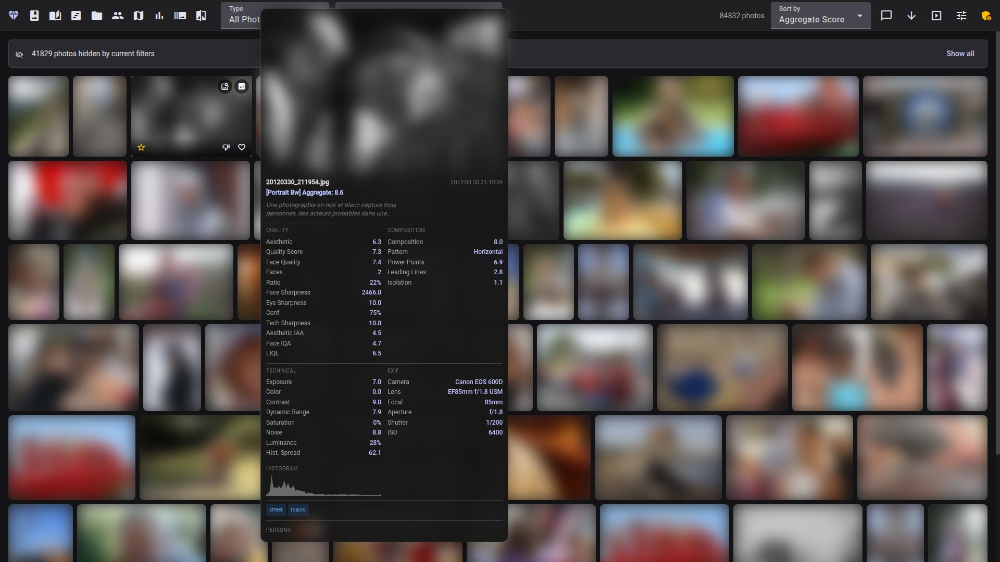

### Trier

- **Détection de rafales** — regroupe les prises de vue en rafale et sélectionne automatiquement la meilleure d'après la netteté, la qualité et la détection des clignements
- **Groupes de similarité** — trouve les photos visuellement similaires dans toute la bibliothèque, quel que soit leur moment de prise de vue
- **Scènes** — regroupe une séance en « scènes » chronologiques selon les écarts entre prises de vue, pour trier dans l'ordre du récit ; touchez pour marquer puis confirmez pour rejeter
- **Nettoyage des indésirables** — détection zero-shot des fichiers non photographiques parasites (captures d'écran, documents, reçus, mèmes, diapositives) avec une file de revue rapide : conservez ou rejetez chaque candidat, ou rejetez-les tous d'un coup
- **Badges par visage au tri** — la visionneuse de tri affiche des badges par visage (yeux ouverts/fermés, expression, confiance de détection) au lieu d'un seul indicateur de clignement au niveau de la photo
- **Détection des clignements** — signale les prises aux yeux fermés pour les masquer ou les rejeter en un clic
- **Détection des doublons** — identifie les images quasi identiques par hachage perceptuel

<table><tr>
<td>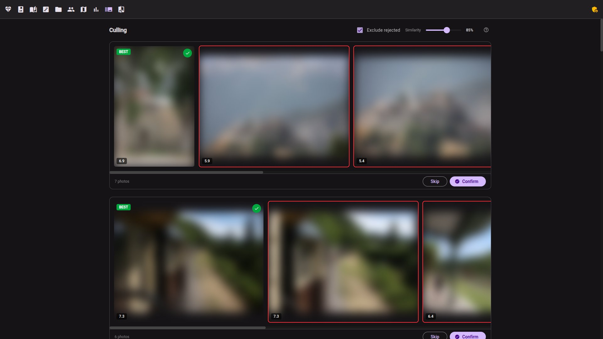</td>
<td>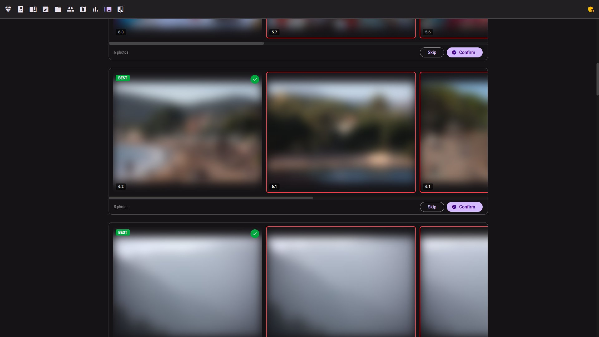</td>
</tr></table>

### Parcourir

- **Modes de galerie** — mosaïque (rangées justifiées préservant les proportions) et grille (cartes uniformes avec superposition des métadonnées)
- **Filtres** — plage de dates, tag de contenu, motif de composition, appareil, objectif, personne, niveau de qualité, note (étoiles) et plages de métriques personnalisées
- **Recherche sémantique** — saisissez une requête en langage naturel comme « coucher de soleil à la plage » et trouvez les photos correspondantes grâce à la recherche par embedding et par texte
- **Chronologie** — navigateur chronologique avec navigation par année/mois et défilement infini
- **Carte** — photos géolocalisées sur une carte interactive avec regroupement des marqueurs
- **Capsules** — diaporamas thématiques : voyages avec noms de lieux, collection dorée, palettes saisonnières, photos d'une personne, et plus encore
- **Dossiers** — parcours par structure de répertoires avec fil d'Ariane et photos de couverture
- **Souvenirs** — « Ce jour-là » : photos prises à la même date les années précédentes
- **Diaporama** — mode plein écran avec transitions thématiques, enchaînement automatique entre capsules et contrôles au clavier

<table><tr>
<td>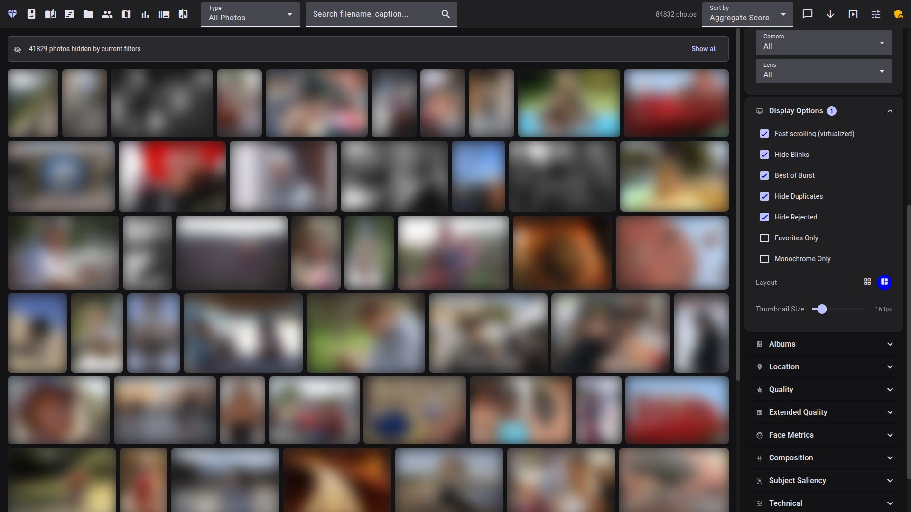</td>
<td>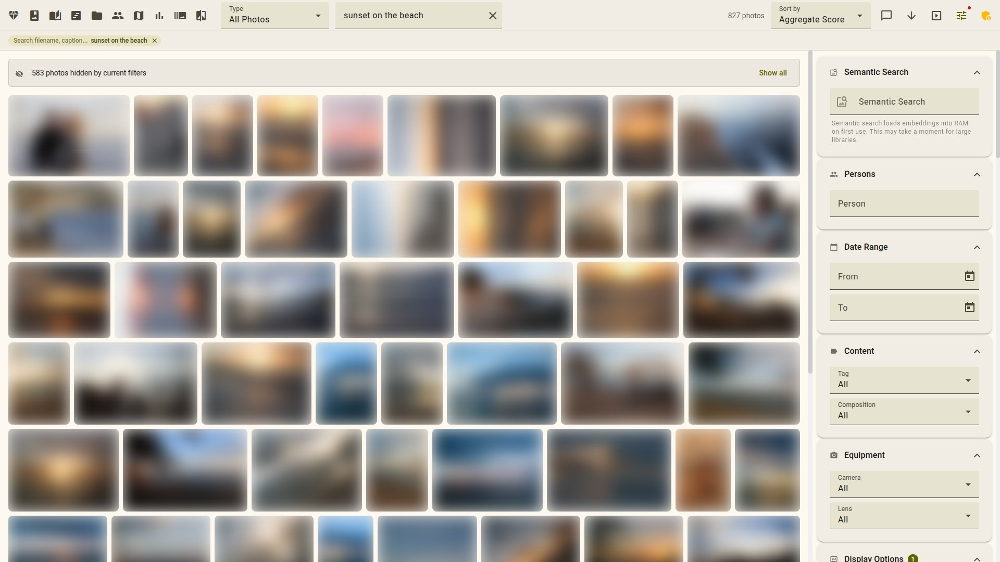</td>
</tr></table>

<details><summary>Barre latérale de filtres — toutes les sections développées (cliquer pour afficher)</summary>
<p align="center">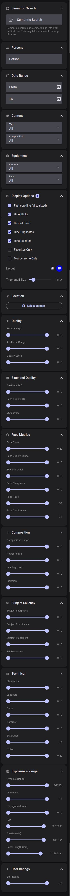</p>
</details>

**Conseils de flux de travail :**
- Pour une revue chronologique d'un voyage ou d'une année, ouvrez **`/timeline`** — triez par agrégat pour parcourir les meilleures prises d'une journée, ou paginez mois par mois.
- La vue **`/capsules`** génère des diaporamas thématiques (voyages, « Visages de », saisonniers, dorés) que vous pouvez enregistrer comme albums.
- La galerie masque par défaut les clignements, les rafales secondaires et les doublons. Lorsque la bannière **« N photos masquées par les filtres actuels »** apparaît, cliquez sur « Tout afficher » pour développer la vue.

### Organiser

- **Reconnaissance faciale** — détection automatique des visages, regroupement en personnes et détection des clignements. Recherchez, renommez, fusionnez et organisez les groupes de personnes depuis l'interface de gestion. Les **suggestions de fusion** repèrent les groupes au visage semblable qui pourraient être la même personne.
- **Albums** — collections manuelles avec glisser-déposer, ou albums intelligents qui se remplissent automatiquement à partir de combinaisons de filtres enregistrées
- **Notes et favoris** — notes (étoiles) (1 à 5), favoris et marqueurs de rejet. Faites défiler les notes en un seul clic.
- **Tags** — tags de contenu générés par IA avec un vocabulaire configurable. Cliquez sur n'importe quel tag pour filtrer la galerie.
- **Opérations par lots** — sélection multiple par Maj+clic, Ctrl+clic ou Ctrl+A (tout sélectionner). Définissez des notes, basculez les favoris, marquez des rejets ou ajoutez à des albums en masse — avec une annulation de 7 secondes pour chaque action par lot.
- **Tout au clavier** — les flèches naviguent dans la galerie, Entrée ouvre, Espace sélectionne ; appuyez sur `?` à tout moment pour afficher l'aide-mémoire des raccourcis.

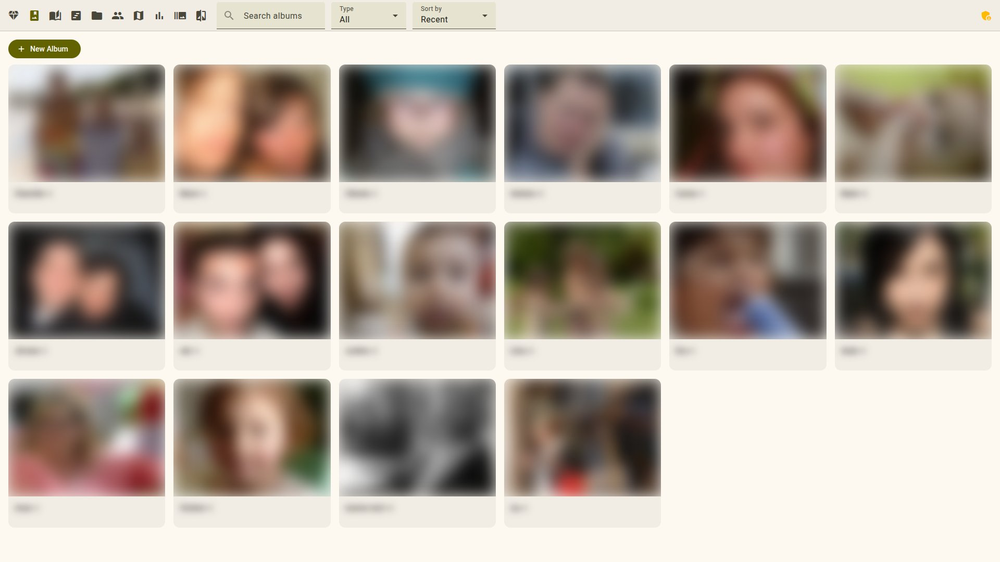

<table><tr>
<td>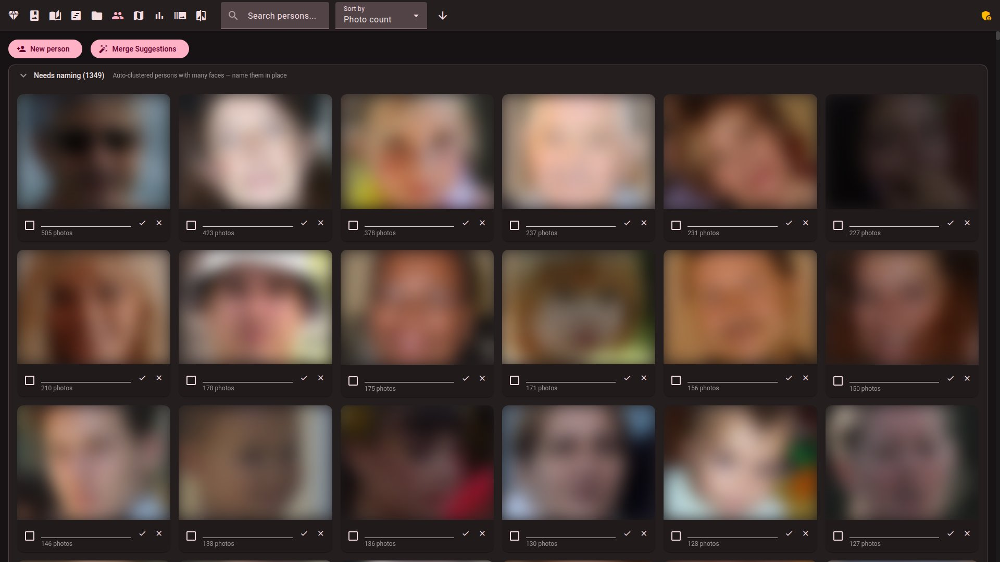</td>
<td>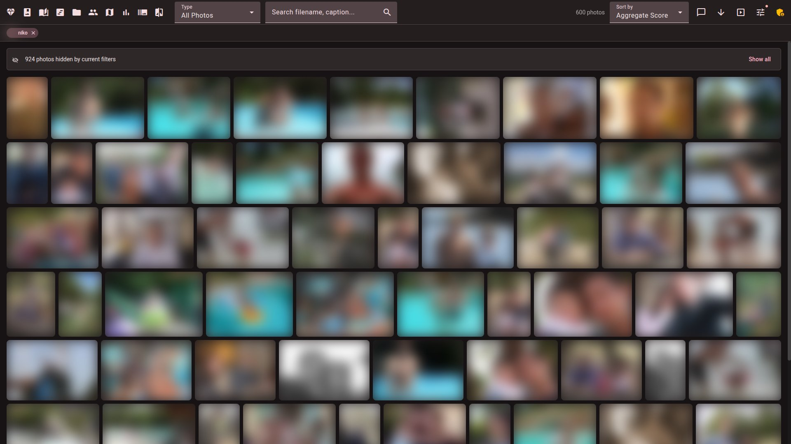</td>
</tr></table>

### Comprendre

- **Statistiques** — tableaux de bord sur l'utilisation du matériel, la répartition par catégorie, la chronologie de prise de vue et les corrélations entre métriques
- **Critique IA** — détail du score montrant la contribution de chaque métrique ; évaluation en langage naturel par VLM `[GPU]` `[16gb/24gb]`
- **Réglage des poids** — éditeur de poids par catégorie avec aperçu du score en direct. La comparaison A/B de photos apprend de vos choix et suggère des poids optimisés.
- **Tri « Mon goût »** — triez la galerie selon le score appris du classeur personnel, avec un badge de confiance indiquant la couverture apprise et la précision sur données de validation
- **Apprentissage à partir des étiquettes** — les décisions de tri, les notes (étoiles), les favoris et les rejets alimentent l'optimiseur de poids (`--sync-label-comparisons`, `--mine-insights`)
- **Instantanés** — enregistrez, restaurez et comparez des configurations de poids
- **Histogramme** — histogramme de luminance dans l'infobulle de la photo et la vue détaillée
- **Légendes IA** `[GPU]` `[16gb/24gb]` — descriptions textuelles, modifiables `[Edition]` et traduisibles en 5 langues (la génération et la consultation sont ouvertes)

<table><tr>
<td>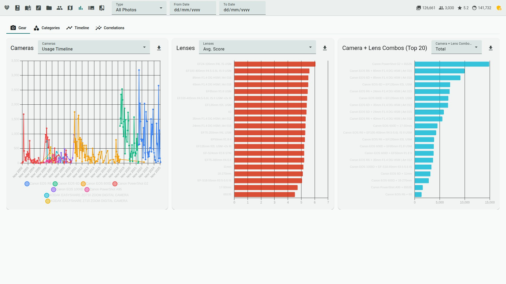</td>
<td>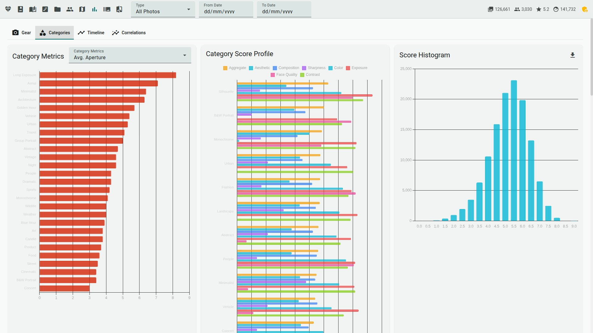</td>
</tr></table>

<table><tr>
<td>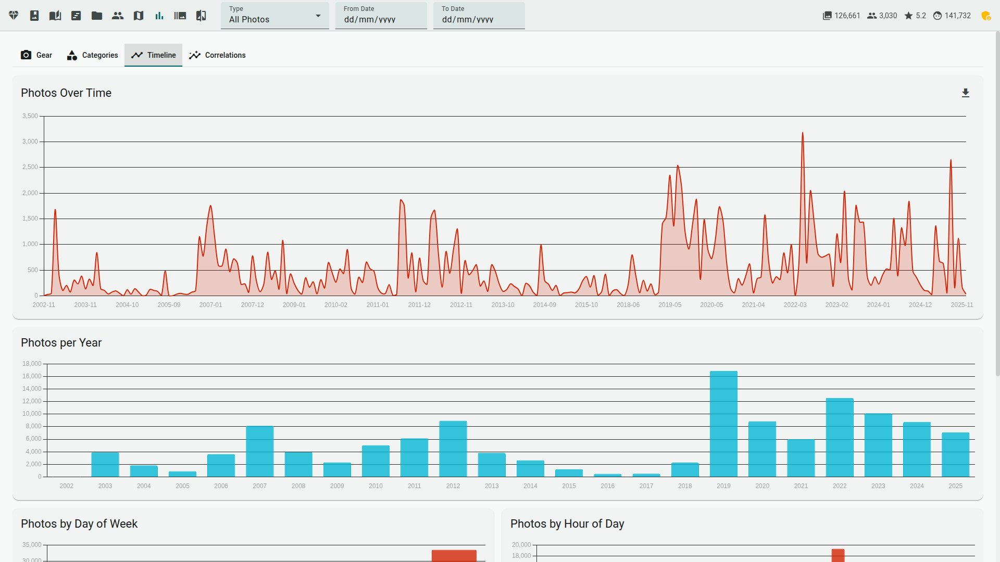</td>
<td>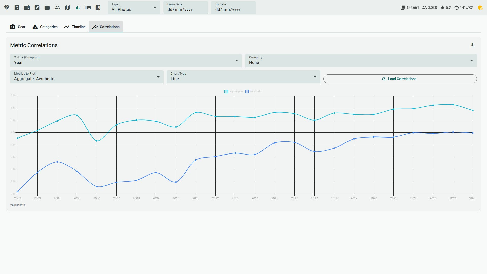</td>
</tr></table>

<table><tr>
<td>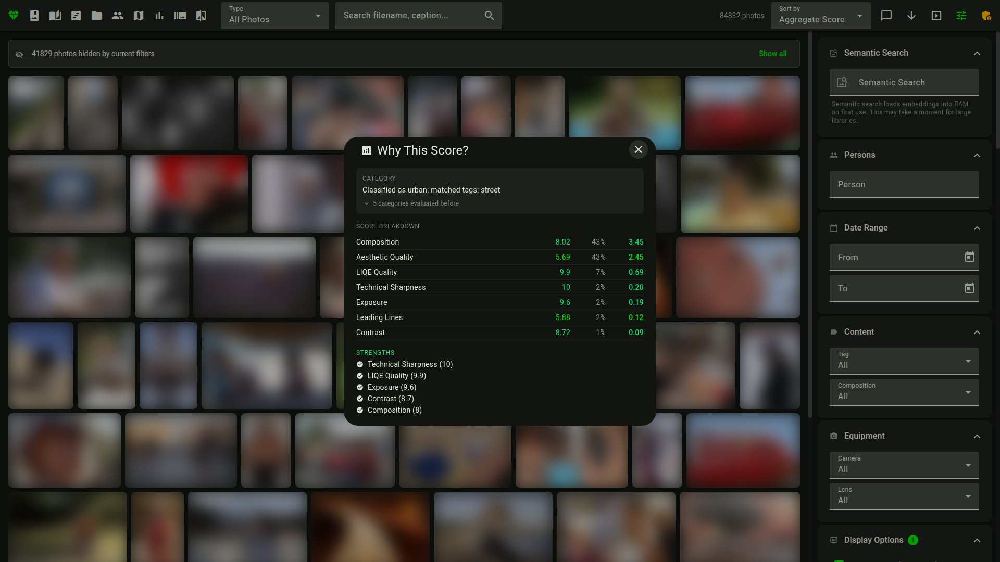</td>
<td>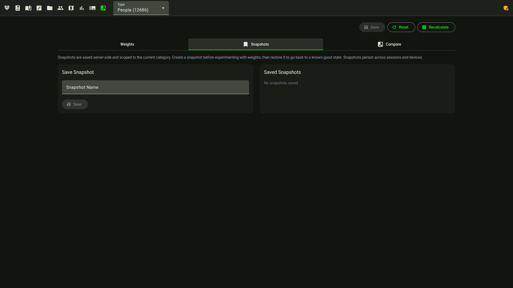</td>
</tr></table>

<table><tr>
<td>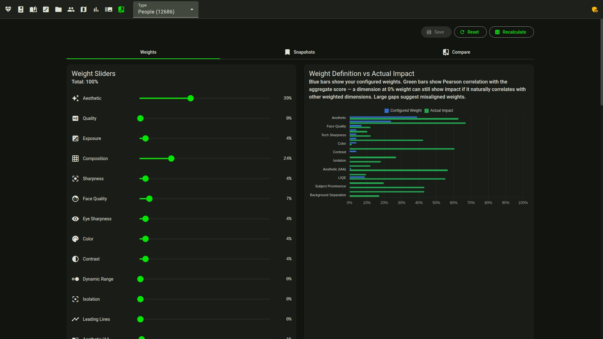</td>
<td>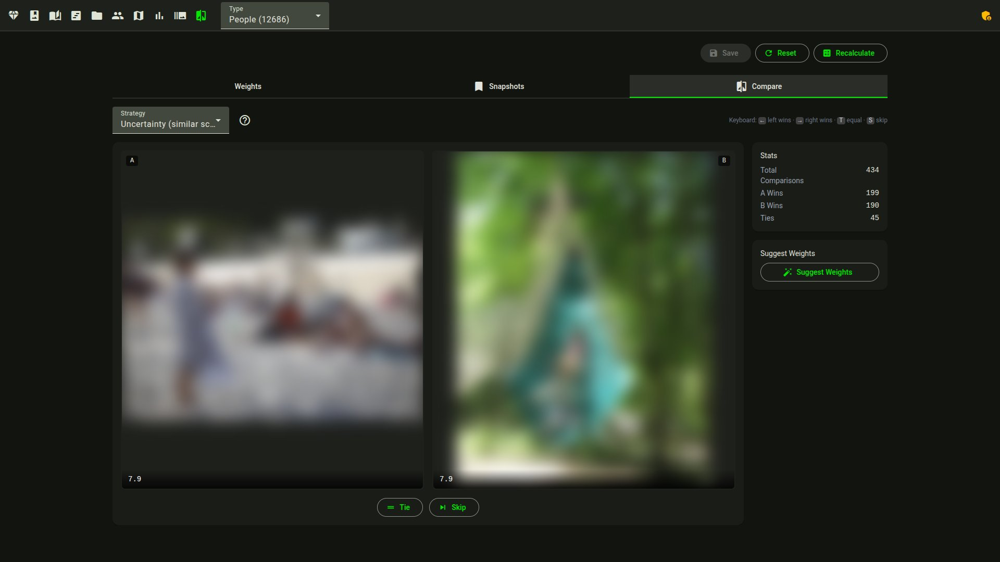</td>
</tr></table>

### Partager

- **Partage d'albums** — générez des liens partageables pour n'importe quel album, sans connexion requise pour les destinataires. Révoquez l'accès à tout moment.
- **Téléchargement de photos** — téléchargez des photos individuelles ou des sélections depuis la galerie
- **Export** — exportez tous les scores en CSV ou JSON pour une analyse externe

### En plus

- **Mode sombre et clair** avec 10 thèmes de couleur d'accent ; respecte la préférence du système
- **Adaptatif** — s'adapte du mobile au bureau, avec une feuille d'actions par lot tactile sur les petits écrans
- **PWA installable** — manifeste d'application web + service worker : installation sur l'écran d'accueil, coque d'application hors ligne, miniatures en cache
- **Galerie virtualisée** — n'affiche qu'une poignée de nœuds DOM quelle que soit la taille de la bibliothèque, pour un défilement rapide même au-delà de 100 000 photos
- **Analyses reprenables** — les analyses interrompues reprennent (`--resume`), les fichiers en échec sont suivis et réessayables (`--retry-failed`), la progression est diffusée vers l'interface web
- **6 langues** — anglais, français, allemand, espagnol, italien, portugais brésilien
- **Multi-utilisateur** — répertoires, notes et accès par rôle propres à chaque utilisateur
- **Plugins et webhooks** — actions personnalisées déclenchées sur les événements d'évaluation
- **Analyse depuis l'interface web** — déclenchez des analyses depuis le navigateur (rôle superadmin)

<table><tr>
<td width="33%">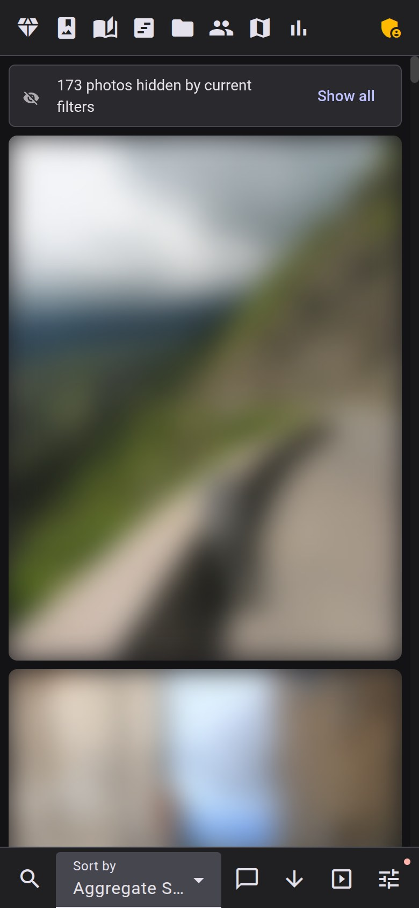</td>
<td width="33%">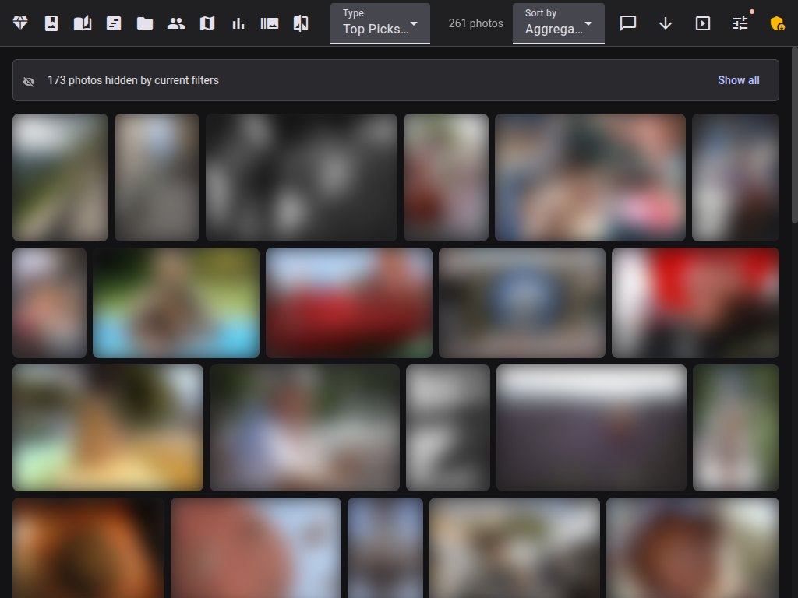</td>
<td width="33%">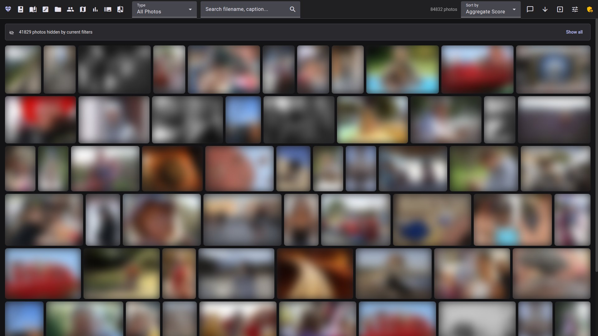</td>
</tr></table>

## Ce dont vous avez besoin

L'essentiel de Facet fonctionne sur **n'importe quelle machine (CPU)** — l'évaluation, la détection de visages, le tri, la galerie, la recherche, les albums et l'export des métadonnées fonctionnent tous sans GPU. Un **GPU** (avec le profil `16gb` ou `24gb`) débloque les modèles les plus performants : l'évaluation esthétique TOPIQ, les embeddings SigLIP 2, le tagging par VLM, les légendes et la critique IA, ainsi que la saillance du sujet. Pas de GPU local ? Pointez le tagging, le légendage et la critique VLM vers un serveur **Ollama** ou **compatible OpenAI** distant via `vlm_backend` dans `scoring_config.json` — ces fonctionnalités fonctionnent alors aussi sur les profils CPU `legacy`/`8gb`. Dans le visualiseur, les actions d'édition (notes, visages, tri) nécessitent le **mot de passe d'édition**, et le déclenchement des analyses nécessite le rôle **superadmin**.

→ Prérequis complets par fonctionnalité (GPU, profil VRAM, paquets optionnels, authentification) : **[Installation › Exigences par fonctionnalité](docs/fr/INSTALLATION.md#exigences-par-fonctionnalité)**.

## Facet est-il fait pour vous ?

Facet évalue, classe et trie une bibliothèque de photos locale et sert une galerie pour la parcourir. Il fonctionne sur votre propre matériel et garde vos photos hors du cloud.

**Un bon choix si vous :**

- possédez une grande bibliothèque locale et souhaitez trouver vos meilleures prises et écarter les rafales et quasi-doublons ;
- voulez une évaluation de la qualité, de la composition et des visages que vous pouvez régler selon votre propre goût (elle apprend de vos comparaisons A/B) ;
- préférez l'auto-hébergement et la confidentialité — aucun envoi vers le cloud, aucun compte, aucun abonnement ;
- éditez déjà dans Lightroom, darktable, digiKam ou immich — Facet écrit les notes, les libellés, les mots-clés, les légendes et les régions de visages nommés dans des fichiers annexes `.xmp` (les originaux restent intacts par défaut) et peut, en option, les intégrer dans le fichier pour les formats JPEG/HEIC/TIFF/PNG/DNG (l'action « Écrire les métadonnées dans le fichier » de la galerie ou `--export-sidecars --embed-originals`), et relit les modifications externes avec `--import-sidecars`.

**Probablement pas pour vous si vous voulez :**

- un remplaçant de Google Photos clé en main, mobile et adossé au cloud, avec sauvegarde automatique du téléphone ;
- de l'édition ou du développement RAW — Facet évalue et organise, il n'édite pas ;
- une application de bureau sans configuration — il faut Python, et les meilleurs modèles nécessitent un GPU.

**Comment il se situe par rapport aux autres outils**

- Les bibliothèques auto-hébergées (Immich, PhotoPrism) se concentrent sur l'organisation, la recherche et la sauvegarde. Facet ajoute l'évaluation de la qualité, le classement et un flux de tri qu'elles n'ont pas, mais il n'a ni application mobile ni sauvegarde/synchronisation intégrée.
- Les applications de tri par IA (Aftershoot, Narrative, FilterPixel) sont des trieurs commerciaux soignés, souvent avec l'édition intégrée. Facet est gratuit, local, plus large (galerie, recherche, visages), et son évaluation est réglable — mais c'est un projet d'un seul développeur, sans leur support ni leur édition RAW.
- Les éditeurs et catalogues (Lightroom, darktable, digiKam) développent et gèrent les photos. Facet les complète via l'interop de métadonnées XMP décrite ci-dessus plutôt que de les remplacer.

Le score esthétique repose sur un modèle et reste approximatif ; attendez-vous à régler les poids pour les faire correspondre à votre goût.

## Démarrage rapide

### Docker (recommandé)

```bash
docker compose up
# Ouvrir http://localhost:5000
```

Cela s'exécute en mode CPU — aucun GPU requis pour parcourir et servir une bibliothèque existante. Montez votre répertoire de photos dans `docker-compose.yml`.

**L'accélération GPU** (optionnelle) nécessite un GPU NVIDIA et le [NVIDIA Container Toolkit](https://docs.nvidia.com/datacenter/cloud-native/container-toolkit/install-guide.html). Activez-la avec le fichier de surcharge :

```bash
docker compose -f docker-compose.yml -f docker-compose.gpu.yml up
```

### Installation manuelle

```bash
git clone https://github.com/ncoevoet/facet.git && cd facet
bash install.sh          # détecte automatiquement le GPU, crée le venv, installe tout

source venv/bin/activate         # macOS/Linux
# .\venv\Scripts\Activate.ps1    # Windows PowerShell

python facet.py /photos  # noter les photos
python viewer.py         # démarrer la galerie web → http://localhost:5000
```

> **macOS :** le récepteur AirPlay du Centre de contrôle occupe le port 5000 par défaut. Si vous voyez « Address already in use », lancez `python viewer.py --port 5001`.

Le script d'installation détecte automatiquement votre version de CUDA, installe la bonne variante de PyTorch, compile l'interface Angular et vérifie tous les imports. Options : `--cpu` (forcer le CPU), `--cuda 12.8` (forcer la version de CUDA), `--skip-client` (ignorer la compilation de l'interface).

<details>
<summary>Installation manuelle pas à pas</summary>

```bash
# 1. Installer exiftool (optionnel mais recommandé)
# Ubuntu/Debian : sudo apt install libimage-exiftool-perl
# macOS :         brew install exiftool

# 2. Créer l'environnement virtuel
python -m venv venv && source venv/bin/activate

# 3. Installer PyTorch avec CUDA (choisissez votre version sur https://pytorch.org/get-started/locally)
pip install torch torchvision --index-url https://download.pytorch.org/whl/cu128

# 4. Installer les dépendances Python (toutes en une fois — voir Dépannage en cas de conflits)
pip install -r requirements.txt

# 5. Installer ONNX Runtime pour la détection de visages (en choisir UN)
pip install onnxruntime-gpu>=1.17.0   # GPU (CUDA 12.x)
# pip install onnxruntime>=1.15.0     # repli CPU

# 6. Compiler le frontend Angular
cd client && npm install && npx ng build && cd ..

# 7. Noter les photos et démarrer la galerie web
python facet.py /path/to/photos
python viewer.py
```
</details>

Lancez `python facet.py --doctor` pour diagnostiquer les problèmes de GPU. Voir [Installation](docs/fr/INSTALLATION.md) pour les profils VRAM, les paquets de tagging par VLM (16gb/24gb), les dépendances optionnelles et le [dépannage des conflits de dépendances](docs/fr/INSTALLATION.md#troubleshooting-dependency-conflicts).

## Documentation

| Document | Description |
|----------|-------------|
| [Installation](docs/fr/INSTALLATION.md) | Prérequis, configuration GPU, profils VRAM, dépendances |
| [Commandes](docs/fr/COMMANDS.md) | Référence de toutes les commandes CLI |
| [Configuration](docs/fr/CONFIGURATION.md) | Référence complète de `scoring_config.json` |
| [Évaluation](docs/fr/SCORING.md) | Catégories, poids, guide de réglage |
| [Reconnaissance faciale](docs/fr/FACE_RECOGNITION.md) | Flux des visages, regroupement, gestion des personnes |
| [Visualiseur](docs/fr/VIEWER.md) | Fonctionnalités et utilisation de la galerie web |
| [Interopérabilité](docs/fr/INTEROP.md) | Faire circuler notes/tags avec Lightroom, Capture One, digiKam, darktable |
| [Déploiement](docs/fr/DEPLOYMENT.md) | Déploiement en production (NAS Synology, Linux, Docker) |
| [Contribuer](CONTRIBUTING.md) | Configuration de développement, architecture, style de code |

## Licence

[MIT](LICENSE)
