# Facet

**A multi-dimensional photo analysis engine that automatically scores, categorizes, and surfaces your best photos using an ensemble of vision models.**

Facet examines every facet of an image—from aesthetic appeal and composition to facial detail and technical precision—to help photographers, archivists, and enthusiasts discover their hidden gems.


<p align="center">
  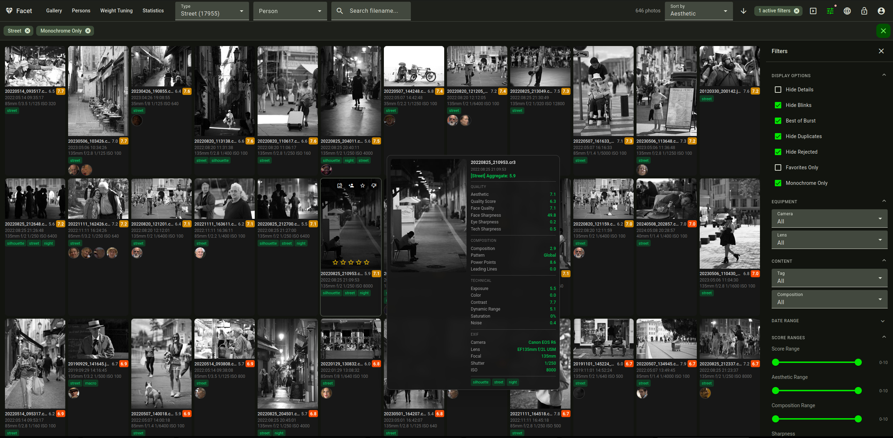
</p>

## How It Works

Point Facet at a directory of photos. Local AI models analyze every image, store scores in a SQLite database, and you browse results in a web viewer. **Everything runs locally — no cloud, no API keys.**

- **Aesthetic quality** — [TOPIQ](https://github.com/chaofengc/IQA-PyTorch) (0.93 SRCC on KonIQ-10k), the leading no-reference quality model
- **Composition** — SAMP-Net detecting 14 patterns (rule of thirds, golden ratio, vanishing point, diagonal, symmetric...)
- **Semantic tagging** — CLIP or Qwen VLMs depending on VRAM profile
- **Face analysis** — InsightFace detection with 106-point landmarks + HDBSCAN clustering into persons
- **Technical metrics** — sharpness, noise, exposure, color harmony, dynamic range, contrast
- **Subject saliency** — InSPyReNet for subject prominence, placement, and background separation
- **Content categorization** — 30 categories with specialized scoring weights (landscape, portrait, architecture, macro, astro, concert, wildlife, street...)

## VRAM Profiles

| Profile | GPU VRAM | Models | Best For |
|---------|----------|--------|----------|
| `auto` | Any | Auto-selected | **Default** — detects VRAM, picks best profile |
| `legacy` | No GPU (8 GB+ RAM) | CLIP+MLP + SAMP-Net + CLIP tagging (CPU) | CPU-only, no GPU required |
| `8gb` | 6–14 GB | CLIP+MLP + SAMP-Net + Qwen3-VL | Better tagging, mid-range GPUs |
| `16gb` | ~14 GB | TOPIQ + SAMP-Net + Qwen3-VL | Best aesthetic accuracy |
| `24gb` | ~18 GB | TOPIQ + Qwen2-VL + Qwen2.5-VL-7B | Best accuracy + VLM tagging |

## Web Viewer

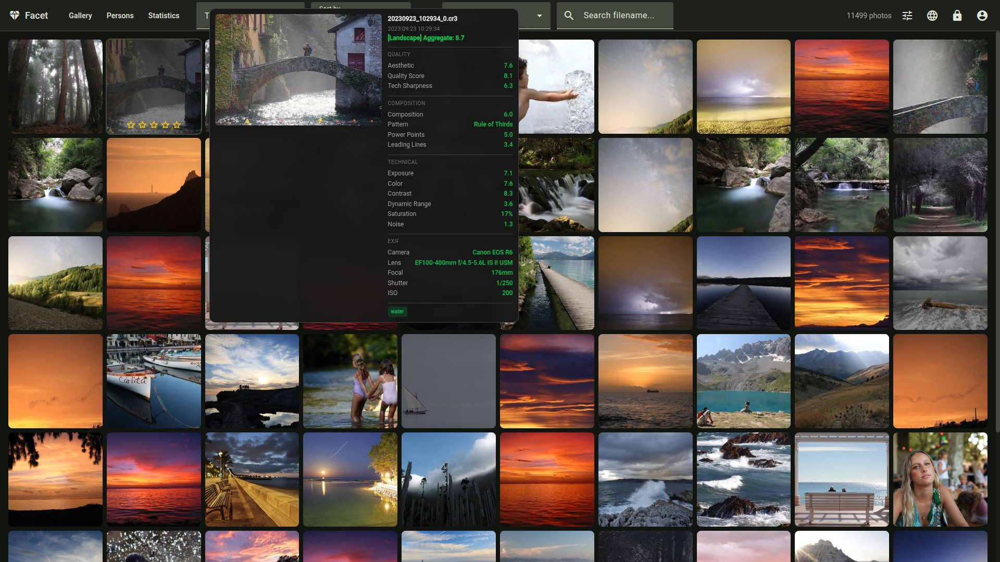

Dark-themed web gallery with hover score breakdowns, EXIF data, content categories, and a Top Picks filter that surfaces the best photos using a custom weighted score. Responsive on mobile.

### Face Recognition

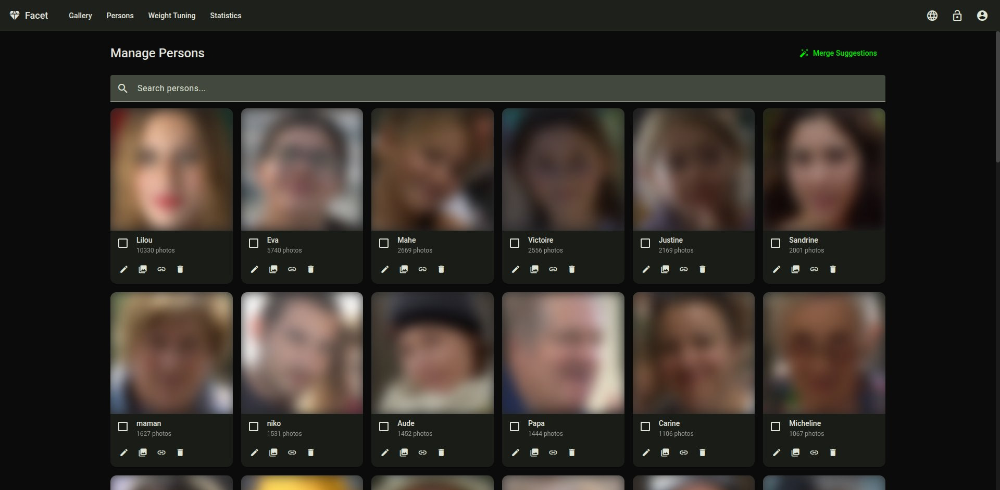
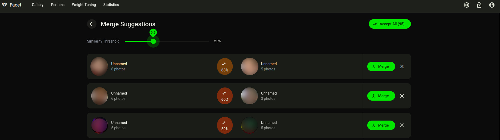

Automatic face detection, HDBSCAN clustering into persons, and blink detection. The management UI lets you merge, rename, and organize person clusters. GPU-accelerated clustering available via cuML.

### Statistics & Analytics

<table><tr>
<td>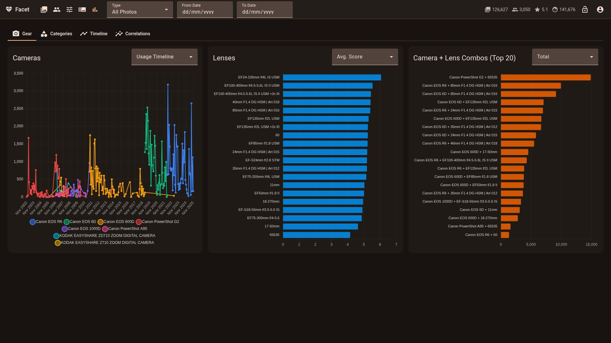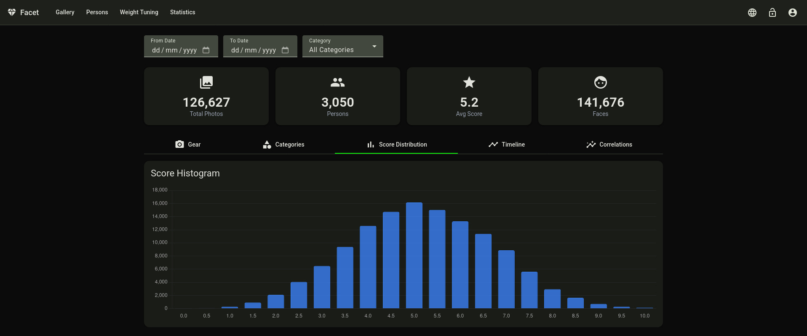</td>
<td>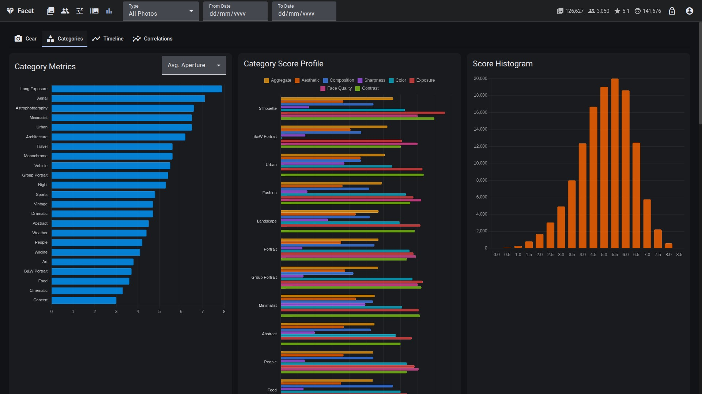</td>
</tr><tr>
<td>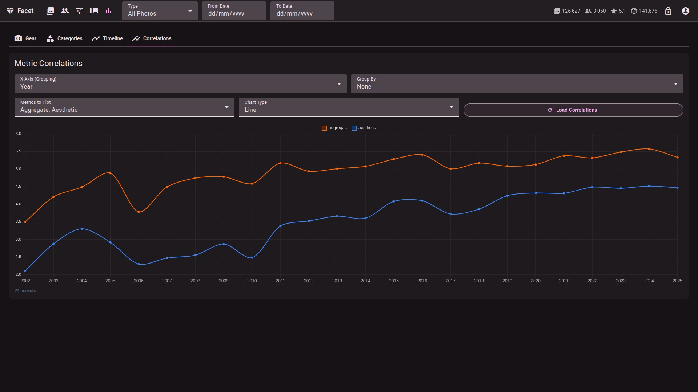</td>
<td>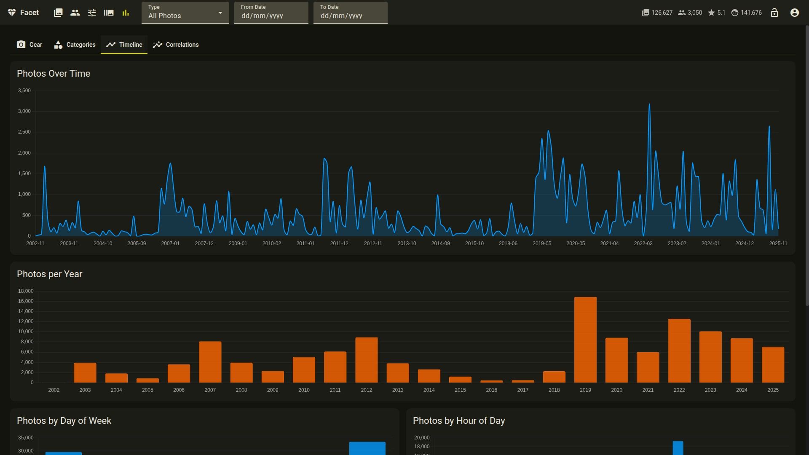</td>
</tr>
</table>

Interactive dashboards with five tabs: **Gear** (cameras, lenses, body+lens combos, scores by camera/lens), **Categories** (breakdown, weights, correlations, overlap — each a sub-tab), **Score Distribution** (aggregate score histogram and distribution charts), **Timeline** (photos per month/year, day-of-week heatmap, top shooting days), and **Correlations** (configurable multi-metric charts across ISO, aperture, focal length, shutter speed, and more).

### Weight Tuning

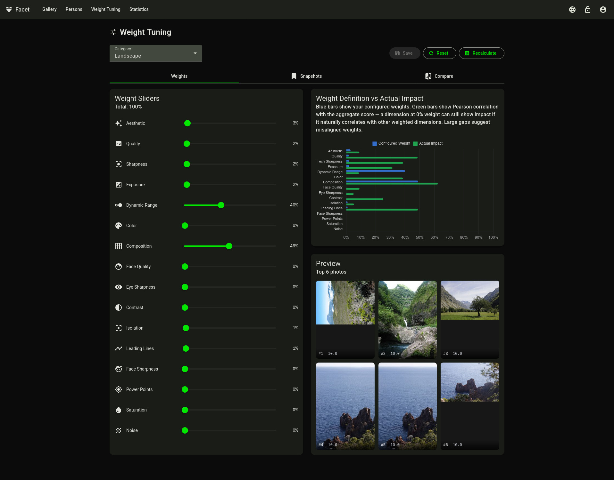
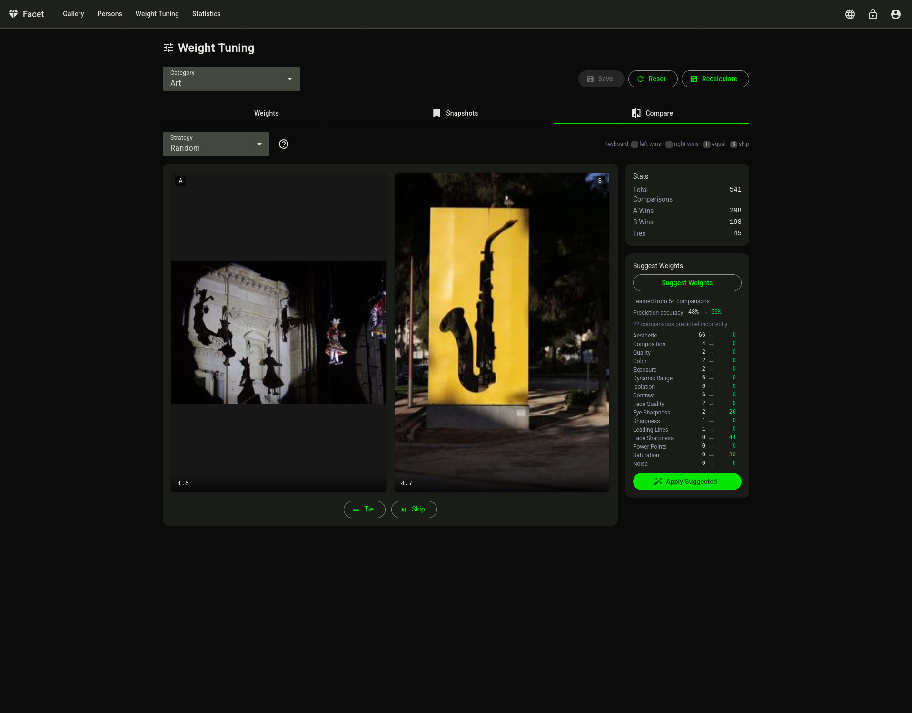

Per-category weight editor with live preview and weight-vs-correlation charts. Pairwise photo comparison with four selection strategies learns from your choices and suggests weight adjustments. **Requires edition mode.**

## Quick Start

```bash
# Install Python dependencies
python -m venv venv && source venv/bin/activate
pip install -r requirements.txt

# Read docs/INSTALLATION.md for optional/additional packages

# Install Angular frontend
cd client && npm install && npx ng build && cd ..

# Score photos (auto-detects VRAM, uses multi-pass mode)
python facet.py /path/to/photos

# Run the web viewer (FastAPI API + Angular SPA)
python viewer.py
# Open http://localhost:5000
```

VRAM is auto-detected at startup. Use `--single-pass` to keep all models loaded simultaneously on high-VRAM systems, or `--pass quality|tags|composition` to run a specific pass.

## Documentation

| Document | Description |
|----------|-------------|
| [Installation](docs/INSTALLATION.md) | Requirements, GPU setup, dependencies |
| [Commands](docs/COMMANDS.md) | All CLI commands reference |
| [Configuration](docs/CONFIGURATION.md) | Full `scoring_config.json` reference |
| [Scoring](docs/SCORING.md) | Categories, weights, tuning guide |
| [Face Recognition](docs/FACE_RECOGNITION.md) | Face workflow, clustering, person management |
| [Viewer](docs/VIEWER.md) | Web gallery features and usage |
| [Deployment](docs/DEPLOYMENT.md) | Production deployment (Synology NAS, Linux, Docker) |
