# Facet

> 🌐 [English](README.md) · [Français](README.fr.md) · [Deutsch](README.de.md) · [Italiano](README.it.md) · [Español](README.es.md) · **Português**

O Facet é um mecanismo local de análise e seleção de fotos. Ele pontua cada imagem em 9 dimensões — da qualidade estética à nitidez dos rostos — e então permite que você navegue, selecione e organize por meio de uma galeria web. Tudo roda na sua máquina; sem nuvem, contas ou chaves de API.


<p align="center">
  
</p>

## Como Funciona

1. **Escanear** — Aponte o Facet para uma pasta de fotos. Cada imagem é analisada quanto à qualidade, composição e rostos. Suporta JPG, HEIF/HEIC e 10 formatos RAW (CR2, CR3, NEF, ARW, RAF, RW2, DNG, ORF, SRW, PEF).
2. **Navegar** — Abra a galeria web para explorar sua biblioteca com filtros, busca e múltiplos modos de visualização.
3. **Selecionar** — O Facet detecta rajadas, sinaliza piscadas, agrupa fotos semelhantes e destaca as melhores escolhas. Os bracketings de exposição e os conjuntos de panorâmica/HDR são reconhecidos e mantidos inteiros, em vez de serem separados pela seleção.

A GPU é detectada automaticamente e é opcional. O Facet roda somente com CPU ou com até 24 GB de VRAM.

## Recursos

### Pontuar

Cada foto é pontuada em 9 dimensões: qualidade estética, composição, qualidade dos rostos, nitidez dos olhos, nitidez técnica, cor, exposição, saliência do sujeito e faixa dinâmica. As fotos são categorizadas por conteúdo (retrato, paisagem, macro, urbana, etc. — mais de 30 categorias) e pontuadas com pesos específicos de cada categoria. Um filtro **Melhores Escolhas** classifica a biblioteca por uma pontuação combinada.

Passe o cursor sobre qualquer foto para ver uma dica com o detalhamento da pontuação e os dados EXIF.

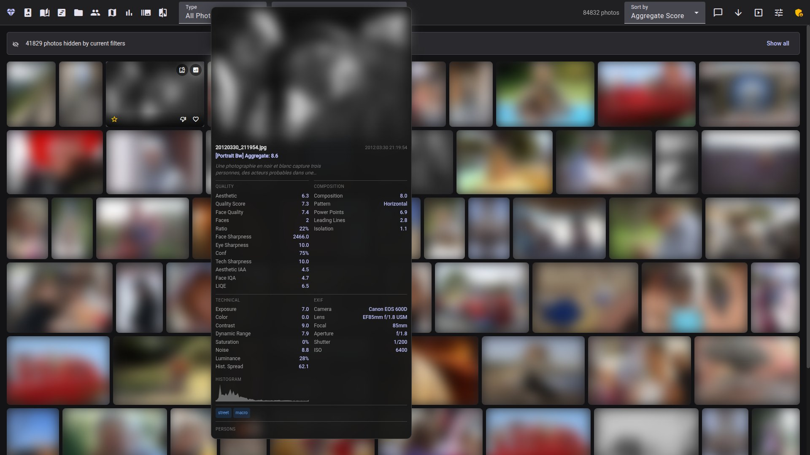

### Selecionar

- **Detecção de rajadas** — agrupa disparos em sequência rápida e seleciona automaticamente o melhor com base em nitidez, qualidade e detecção de piscadas
- **Proteção de sequências** — bracketings de exposição, varreduras panorâmicas e panorâmicas HDR (`--detect-sequences` / `--detect-panoramas`) são reconhecidos como séries deliberadas de vários fotogramas e mantidos inteiros: o laboratório de triagem começa com todas as fotos de uma série marcadas para manter e nunca a reduz a uma única "vencedora"
- **Grupos de similaridade** — encontra fotos visualmente semelhantes em toda a biblioteca, independentemente de quando foram capturadas
- **Cenas** — agrupa uma sessão em "cenas" cronológicas por intervalos do horário de captura, para que você selecione na ordem da narrativa; toque para marcar e confirme para rejeitar
- **Limpeza de lixo** — detecção zero-shot de arquivos não fotográficos supérfluos (capturas de tela, documentos, recibos, memes, slides) com uma fila de revisão rápida: mantenha ou rejeite cada candidato, ou rejeite todos de uma vez
- **Selos de seleção por rosto** — o visualizador de seleção exibe selos por rosto indicando olhos abertos/fechados, expressão e confiança da detecção, em vez de apenas um único indicador de piscada no nível da foto
- **Detecção de piscadas** — sinaliza fotos com olhos fechados para ocultar ou rejeitar com um clique
- **Detecção de duplicatas** — identifica imagens quase idênticas por meio de hashing perceptual

<table><tr>
<td>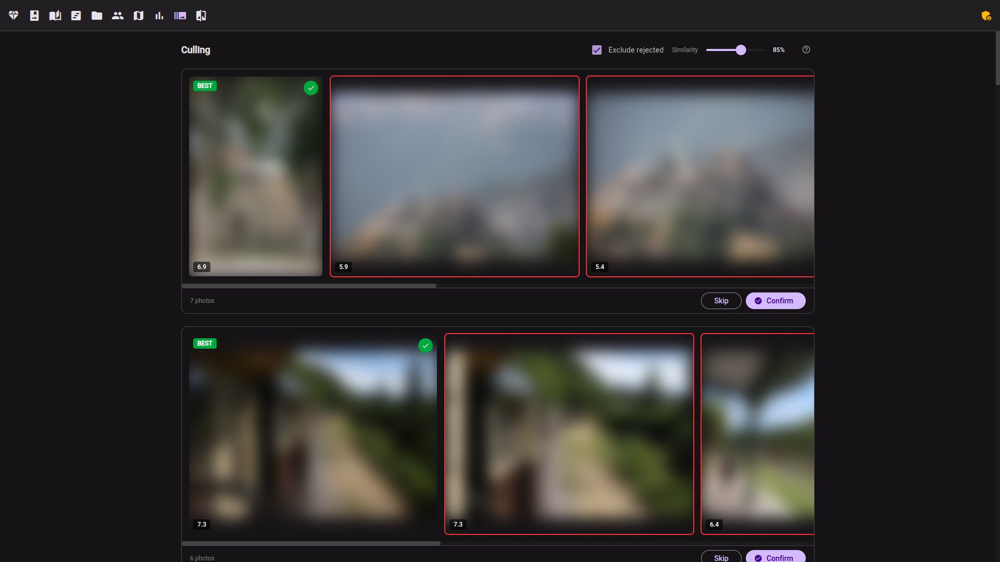</td>
<td>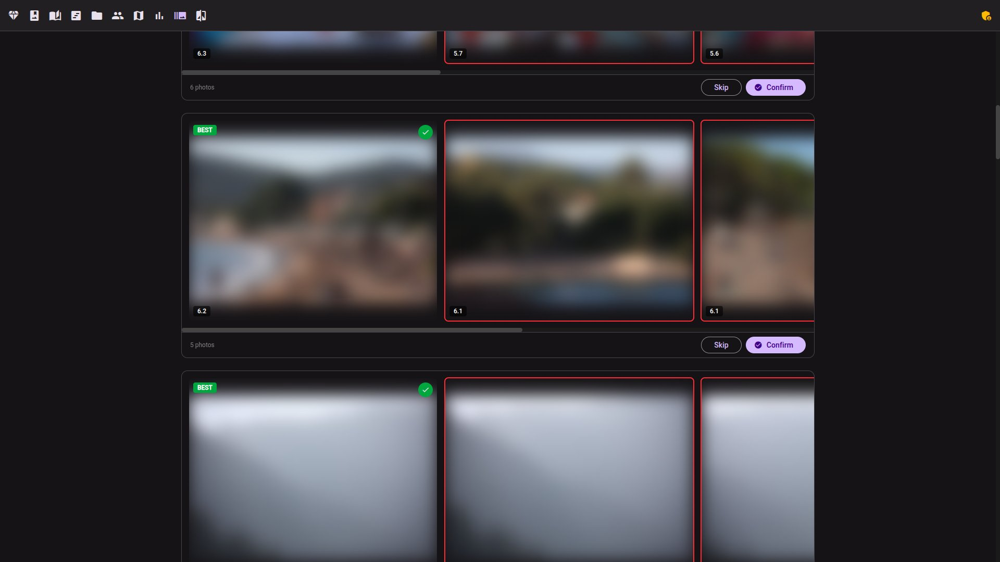</td>
</tr></table>

### Navegar

- **Modos de galeria** — mosaico (linhas justificadas que preservam as proporções) e grade (cards uniformes com sobreposição de metadados)
- **Filtros** — intervalo de datas, tag de conteúdo, padrão de composição, câmera, lente, pessoa, pasta, nível de qualidade, classificação por estrelas e faixas de métricas personalizadas
- **Busca semântica** — digite uma consulta em linguagem natural como "pôr do sol na praia" e encontre fotos correspondentes por meio de busca por embedding e texto
- **Linha do tempo** — navegador cronológico com navegação por ano/mês e rolagem infinita
- **Mapa** — fotos georreferenciadas em um mapa interativo com agrupamento de marcadores
- **Cápsulas** — apresentações temáticas: viagens com nomes de lugares, coleção dourada, paletas sazonais, fotos de uma pessoa e muito mais
- **Pastas** — navegue pela estrutura de diretórios com navegação em trilha e fotos de capa
- **Memórias** — "Neste Dia": fotos da mesma data em anos anteriores
- **Apresentação de slides** — modo de tela cheia com transições temáticas, encadeamento automático entre cápsulas e controles por teclado

<table><tr>
<td>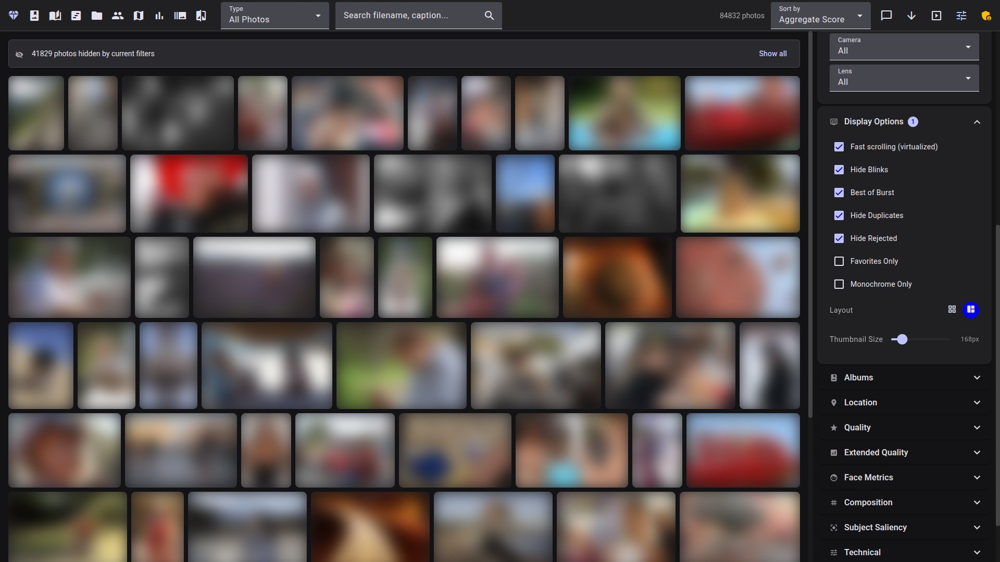</td>
<td>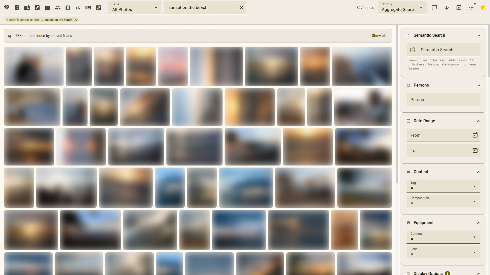</td>
</tr></table>

<details><summary>Barra lateral de filtros completa — todas as seções expandidas (clique para ver)</summary>
<p align="center">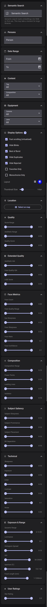</p>
</details>

**Dicas de fluxo de trabalho:**
- A visualização **`/timeline`** desce de anos para meses e depois para um calendário de dias — clique em um dia para abrir a galeria filtrada para essa data. Aqui não há ordenação; para escolher as melhores fotos de uma viagem, use **`/capsules`** abaixo, que aplica uma passagem de diversidade em um intervalo de datas que você pode salvar como álbum.
- A visualização **`/capsules`** gera diaporamas temáticos (viagens, "Rostos de", sazonais, dourada) que você pode salvar como álbuns.
- A galeria oculta piscadas, rajadas não principais e duplicatas por padrão. Quando o banner **"N fotos ocultas pelos filtros atuais"** aparecer, clique em "Mostrar tudo" para expandir a visualização.

### Organizar

- **Reconhecimento facial** — detecção automática de rostos, agrupamento em pessoas e detecção de piscadas. Busque, renomeie, mescle e organize os agrupamentos de pessoas pela interface de gerenciamento. As **sugestões de mesclagem** encontram agrupamentos com aparência semelhante que podem ser a mesma pessoa.
- **Álbuns** — coleções manuais com arrastar e soltar, ou álbuns inteligentes que se preenchem automaticamente a partir de combinações de filtros salvas
- **Classificações e favoritos** — classificações por estrelas (1–5), favoritos e marcações de rejeição. Percorra as classificações com um único clique.
- **Tags** — tags de conteúdo geradas por IA com vocabulário configurável. Clique em qualquer tag para filtrar a galeria.
- **Operações em lote** — seleção múltipla com Shift+clique, Ctrl+clique ou Ctrl+A (selecionar tudo). Defina classificações, alterne favoritos, marque rejeições ou adicione a álbuns em massa — com 7 segundos para desfazer cada ação em lote.
- **Prioridade ao teclado** — as setas navegam pela galeria, Enter abre, Espaço seleciona; pressione `?` em qualquer lugar para ver a referência de atalhos.

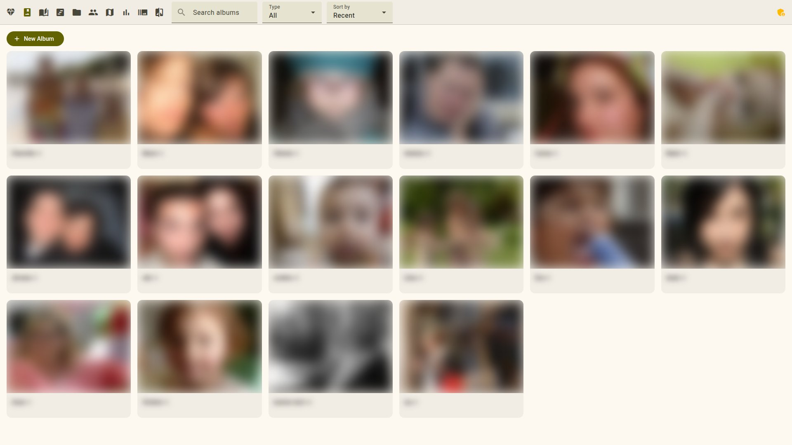

<table><tr>
<td>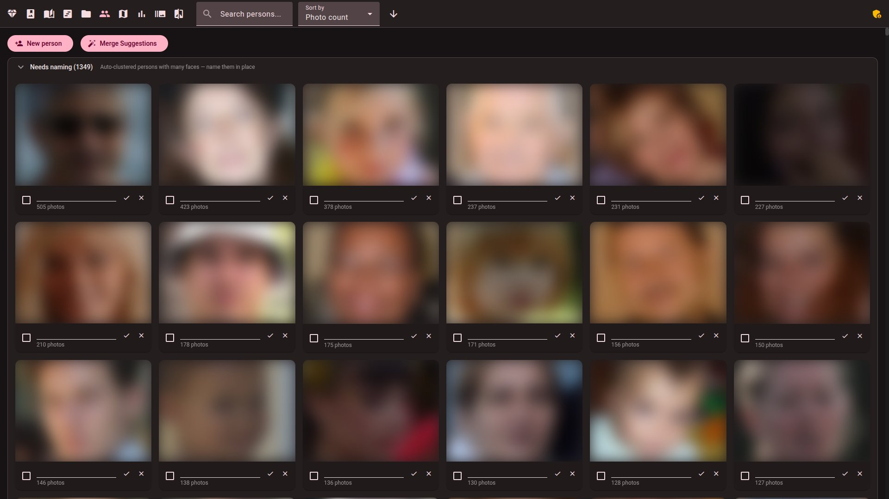</td>
<td>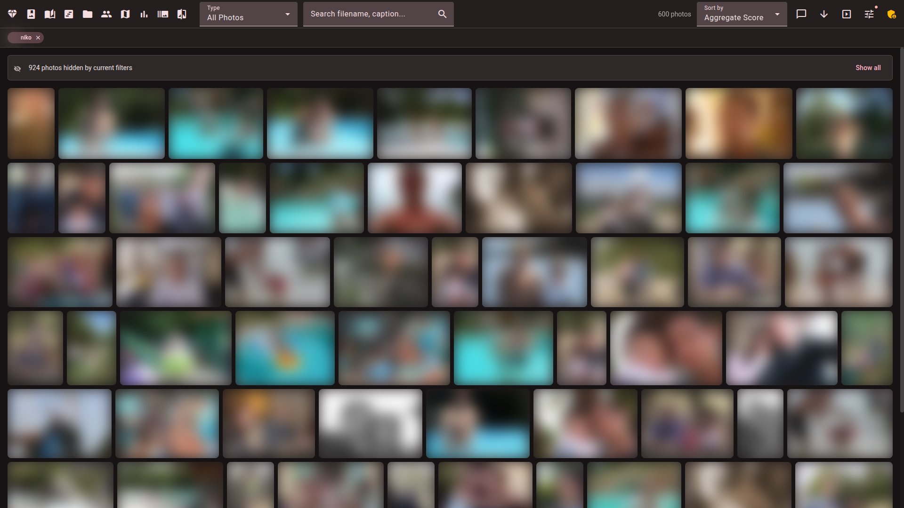</td>
</tr></table>

### Entender

- **Estatísticas** — painéis de uso de equipamentos, detalhamento por categoria, linha do tempo de capturas e correlações de métricas
- **Crítica por IA** — detalhamento da pontuação mostrando a contribuição de cada métrica; avaliação em linguagem natural por VLM `[GPU]` `[16gb/24gb]`
- **Ajuste de pesos** — editor de pesos por categoria com pré-visualização da pontuação em tempo real. A comparação A/B de fotos aprende com suas escolhas e sugere pesos otimizados.
- **Contextos de pontuação** — controle *qual* categoria pontua uma foto, algo independente dos controles de peso, que só ajustam a categoria já escolhida: reordene a prioridade global de categorias, aplique um contexto nomeado (Ação/Palco, Sessão de retrato, Vida selvagem, …) por álbum, ou defina uma substituição de categoria por foto que sobrevive a cada recálculo.
- **Ordenação Meu Gosto** — ordene a galeria pela pontuação aprendida do classificador pessoal, com um selo de confiança que mostra a cobertura aprendida e a precisão em dados separados
- **Aprendizado a partir de rótulos** — decisões de seleção, classificações por estrelas, favoritos e rejeições alimentam o otimizador de pesos (`--sync-label-comparisons`, `--mine-insights`)
- **Snapshots** — salve, restaure e compare configurações de pesos
- **Histograma** — histograma RGB/luminância com indicadores de clipping, na dica da foto e na visualização de detalhes
- **Legendas por IA** `[GPU]` `[16gb/24gb]` — descrições em texto, editáveis `[Edition]` e traduzíveis para 5 idiomas (a geração e a visualização são abertas)

<table><tr>
<td>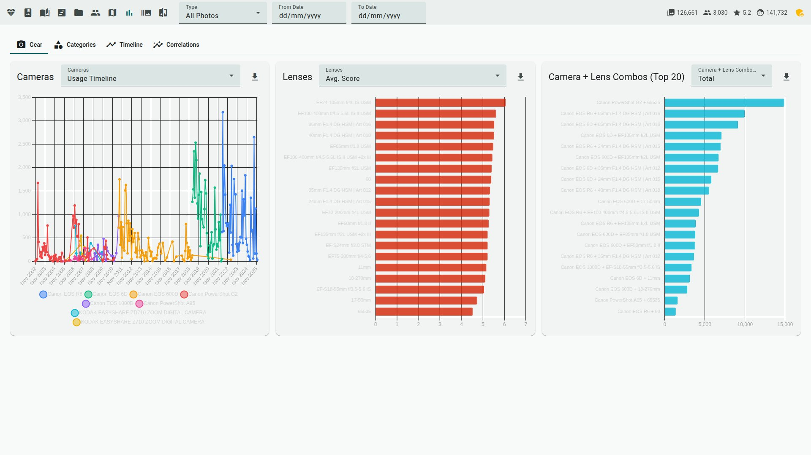</td>
<td>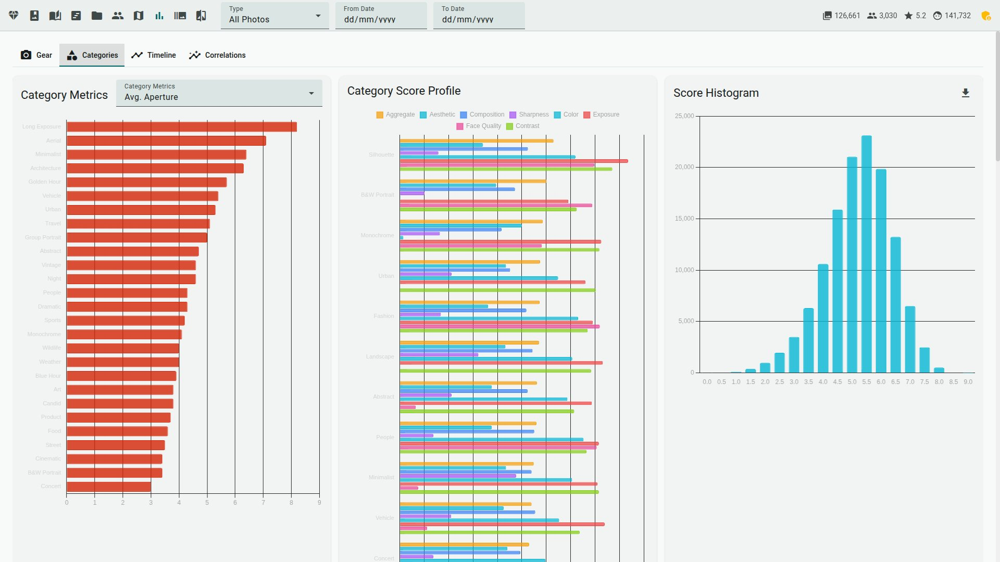</td>
</tr></table>

<table><tr>
<td>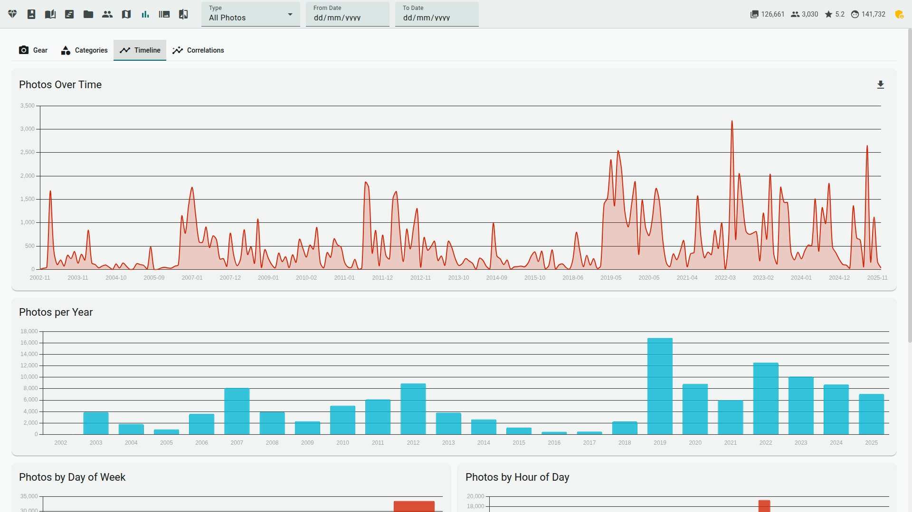</td>
<td>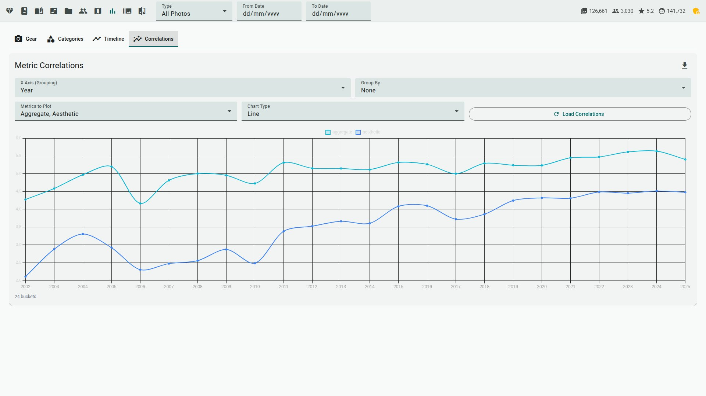</td>
</tr></table>

<table><tr>
<td>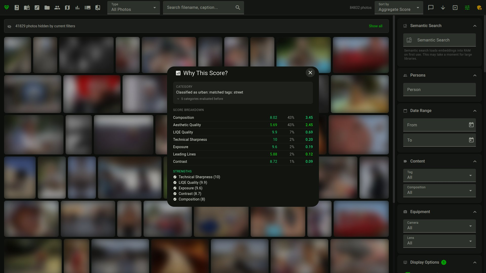</td>
<td>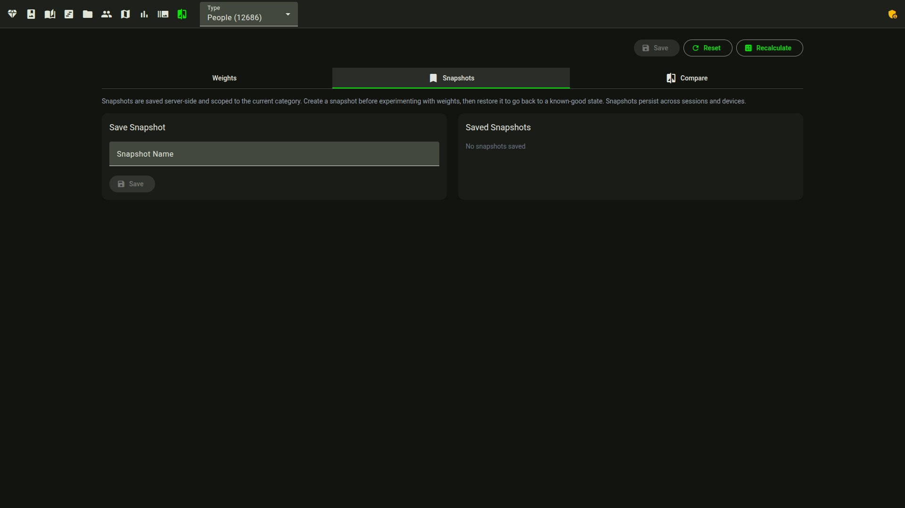</td>
</tr></table>

<table><tr>
<td>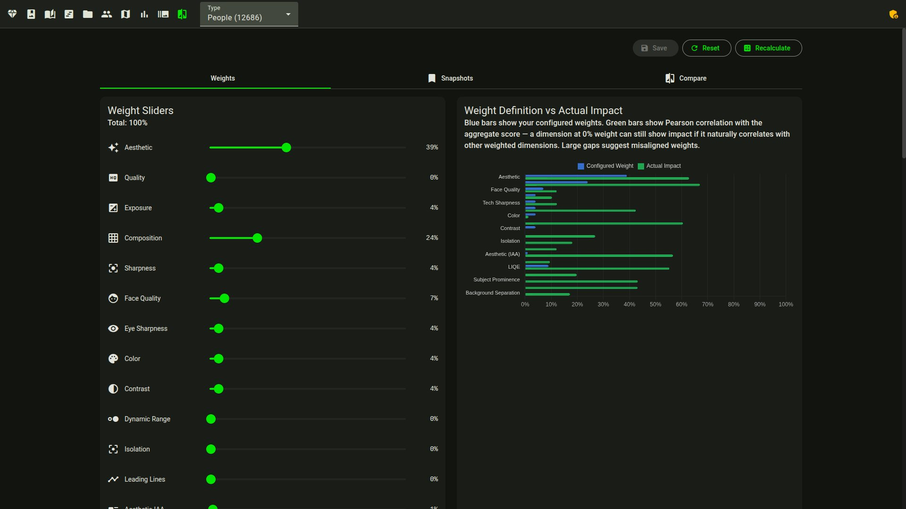</td>
<td>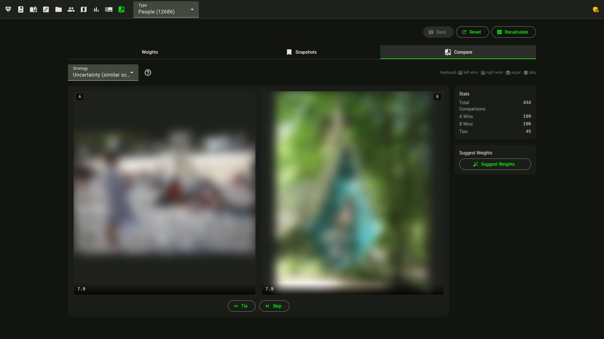</td>
</tr></table>

### Compartilhar

- **Compartilhamento de álbuns** — gere links compartilháveis para qualquer álbum, sem necessidade de login para os destinatários. Revogue o acesso a qualquer momento.
- **Download de fotos** — baixe fotos individuais ou seleções da galeria
- **Exportação** — exporte todas as pontuações para CSV ou JSON para análise externa

### Mais

- **Modo escuro e claro** com 10 temas de cor de destaque; respeita a preferência do sistema
- **Responsivo** — adapta-se do celular ao desktop, com uma folha de ações em massa amigável ao toque em telas pequenas
- **PWA instalável** — manifesto de web app + service worker: instale na tela inicial, shell de app offline e miniaturas em cache
- **Galeria virtualizada** — renderiza um punhado de nós DOM independentemente do tamanho da biblioteca, mantendo a rolagem rápida com mais de 100 mil fotos
- **Escaneamentos retomáveis** — escaneamentos interrompidos são retomados (`--resume`), os arquivos com falha são rastreados e podem ser reprocessados (`--retry-failed`), e o progresso é transmitido para a interface web
- **6 idiomas** — inglês, francês, alemão, espanhol, italiano e português do Brasil
- **Multiusuário** — diretórios, classificações e acesso por função, por usuário
- **Plugins e webhooks** — ações personalizadas acionadas em eventos de pontuação
- **Escaneamento pela interface web** — acione escaneamentos pelo navegador (função superadmin)

<table><tr>
<td width="33%">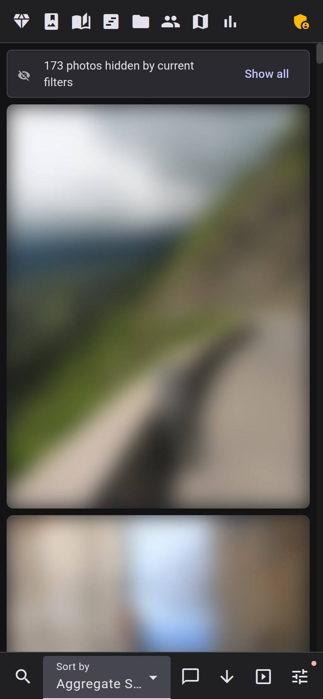</td>
<td width="33%">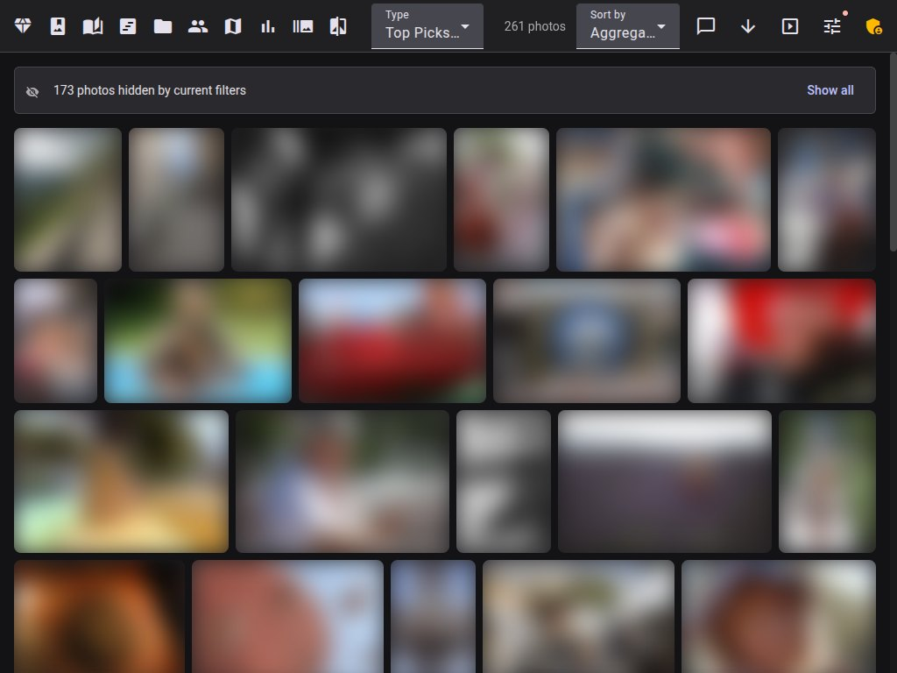</td>
<td width="33%">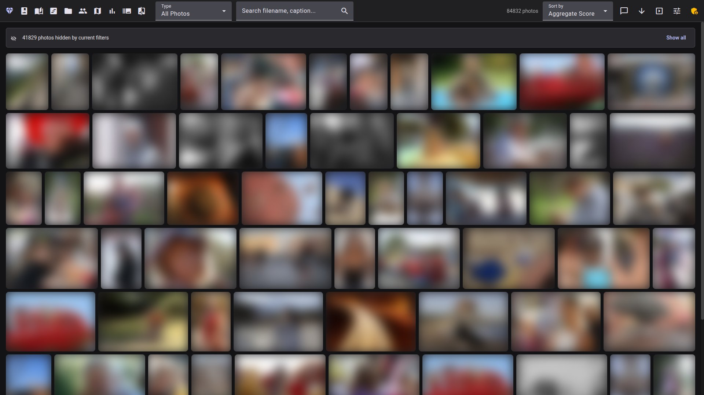</td>
</tr></table>

## O que você precisa

A maior parte do Facet roda em **qualquer máquina (CPU)** — pontuação, detecção de rostos, seleção, a galeria, busca, álbuns e exportação de metadados funcionam sem GPU. Uma **GPU** (com o perfil `16gb` ou `24gb`) libera os modelos mais robustos: pontuação estética TOPIQ, embeddings SigLIP 2, marcação por VLM, legendas e crítica por IA, e saliência do sujeito. Sem GPU local? Aponte a marcação/as legendas/a crítica por VLM para um servidor **Ollama** ou **compatível com OpenAI** remoto via `vlm_backend` no `scoring_config.json` — esses recursos passam a funcionar também nos perfis de CPU `legacy`/`8gb`. No visualizador, as ações de edição (classificações, rostos, seleção) exigem a **senha de edição**, e acionar escaneamentos exige a função **superadmin**.

→ Requisitos completos por recurso (GPU, perfil de VRAM, pacotes opcionais, autenticação): **[Instalação › Requisitos por recurso](docs/pt/INSTALLATION.md#requisitos-por-recurso)**.

## O Facet é para você?

O Facet pontua, classifica e seleciona uma biblioteca local de fotos e serve uma galeria para navegá-la. Ele roda no seu próprio hardware e mantém as fotos fora da nuvem.

**Uma boa escolha se você:**

- tem uma biblioteca local grande e quer encontrar suas melhores fotos e selecionar rajadas e quase duplicatas;
- quer pontuação de qualidade, composição e rostos que você possa ajustar ao seu próprio gosto (ele aprende com suas comparações A/B);
- prefere ser auto-hospedado e privado — sem upload para a nuvem, sem conta, sem assinatura;
- já edita no Lightroom, darktable, digiKam ou immich — o Facet grava classificações, rótulos, palavras-chave, legendas e regiões de rostos nomeados em arquivos auxiliares `.xmp` (originais intocados por padrão) e pode opcionalmente embuti-los no arquivo para JPEG/HEIC/TIFF/PNG/DNG (a ação "Gravar metadados no arquivo" da galeria ou `--export-sidecars --embed-originals`), e relê edições externas com `--import-sidecars`.

**Provavelmente não é para você se você quer:**

- um substituto do Google Fotos pronto para uso, móvel e respaldado pela nuvem, com backup automático do celular;
- edição ou revelação de RAW — o Facet pontua e organiza, ele não edita;
- um app de desktop sem configuração — ele precisa de Python, e os melhores modelos precisam de uma GPU.

**Como ele se relaciona com outras ferramentas**

- Bibliotecas auto-hospedadas (Immich, PhotoPrism) focam em organização, busca e backup. O Facet adiciona pontuação de qualidade, classificação e um fluxo de seleção que elas não têm, mas não possui app móvel nem backup/sincronização integrados.
- Apps de seleção por IA (Aftershoot, Narrative, FilterPixel) são selecionadores comerciais refinados, muitas vezes com edição integrada. O Facet é gratuito, local, mais abrangente (galeria, busca, rostos) e sua pontuação é ajustável — mas é um projeto de desenvolvedor único, sem o suporte ou a edição de RAW que eles oferecem.
- Editores e catálogos (Lightroom, darktable, digiKam) revelam e gerenciam fotos. O Facet os complementa por meio da interoperabilidade de metadados XMP descrita acima, em vez de substituí-los.

A pontuação estética é baseada em modelos e aproximada; espere ajustar os pesos para combinar com seu gosto.

## Início Rápido

### Docker (recomendado)

```bash
git clone https://github.com/ncoevoet/facet.git && cd facet
cp .env.example .env      # abra o .env e defina PHOTOS_DIR para a pasta das suas fotos
docker compose up -d      # depois abra http://localhost:5000
```

Tem uma placa NVIDIA? Use o bloco do tamanho dela em
[Instalação](docs/pt/INSTALLATION.md#instalar-com-docker) — uma linha para cada placa de
8 GB, 16 GB e 24 GB.

### Sem Docker (Linux, macOS)

```bash
git clone https://github.com/ncoevoet/facet.git && cd facet
bash install.sh                        # detecta seu hardware, instala tudo
source venv/bin/activate
python facet.py /path/to/your/photos   # pontue as fotos
python viewer.py                       # galeria → http://localhost:5000
```

> **macOS:** o AirPlay Receiver do ControlCenter ocupa a porta 5000 por padrão. Se você vir "Address already in use", execute `python viewer.py --port 5001`.

Guia completo: **[Instalação](docs/pt/INSTALLATION.md)** — configuração por hardware,
downloads da primeira execução, e
[solução de problemas de dependências](docs/pt/INSTALLATION.md#solução-de-conflitos-de-dependência).
Execute `python facet.py --doctor` para diagnosticar problemas de GPU.

## Documentação

| Documento | Descrição |
|----------|-------------|
| [Instalação](docs/INSTALLATION.md) | Requisitos, configuração de GPU, perfis de VRAM, dependências |
| [Comandos](docs/COMMANDS.md) | Referência de todos os comandos da CLI |
| [Configuração](docs/CONFIGURATION.md) | Referência completa do `scoring_config.json` |
| [Pontuação](docs/SCORING.md) | Categorias, pesos, guia de ajuste |
| [Reconhecimento Facial](docs/FACE_RECOGNITION.md) | Fluxo de trabalho de rostos, agrupamento, gerenciamento de pessoas |
| [Visualizador](docs/VIEWER.md) | Recursos e uso da galeria web |
| [Interoperabilidade](docs/pt/INTEROP.md) | Trocar classificações/tags com Lightroom, Capture One, digiKam, darktable |
| [Immich](docs/pt/IMMICH.md) | Sincronizar avaliações e favoritos com o Immich, além do webhook de entrada |
| [Implantação](docs/DEPLOYMENT.md) | Implantação em produção (Synology NAS, Linux, Docker) |
| [Contribuindo](CONTRIBUTING.md) | Configuração de desenvolvimento, arquitetura, estilo de código |

## Licença

[MIT](LICENSE)
