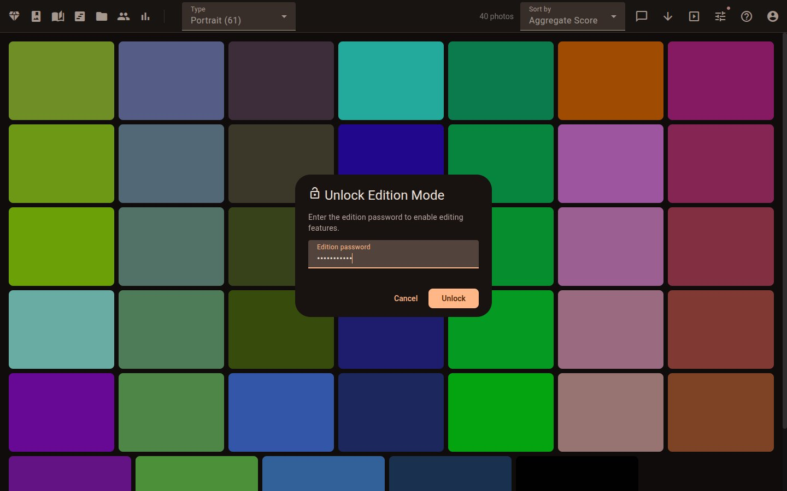
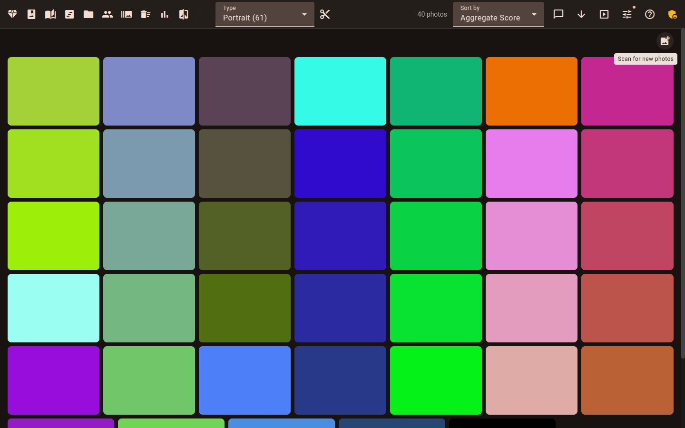
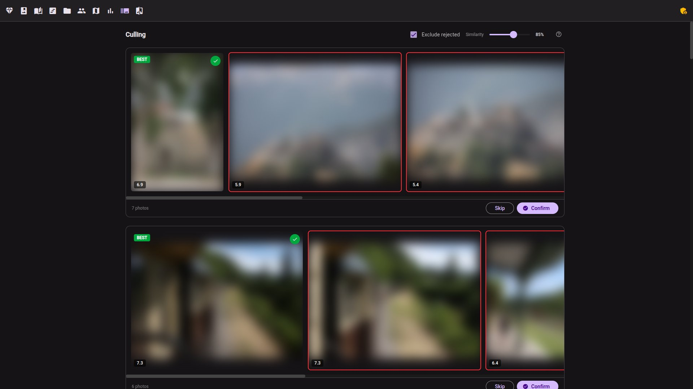
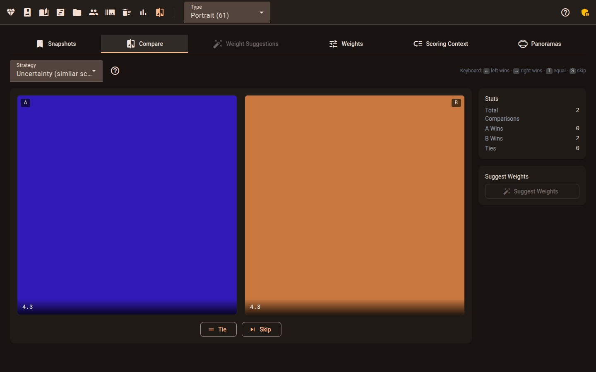
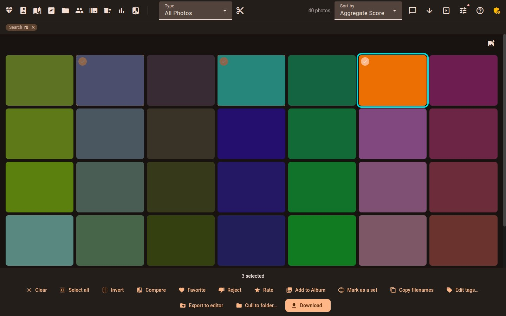
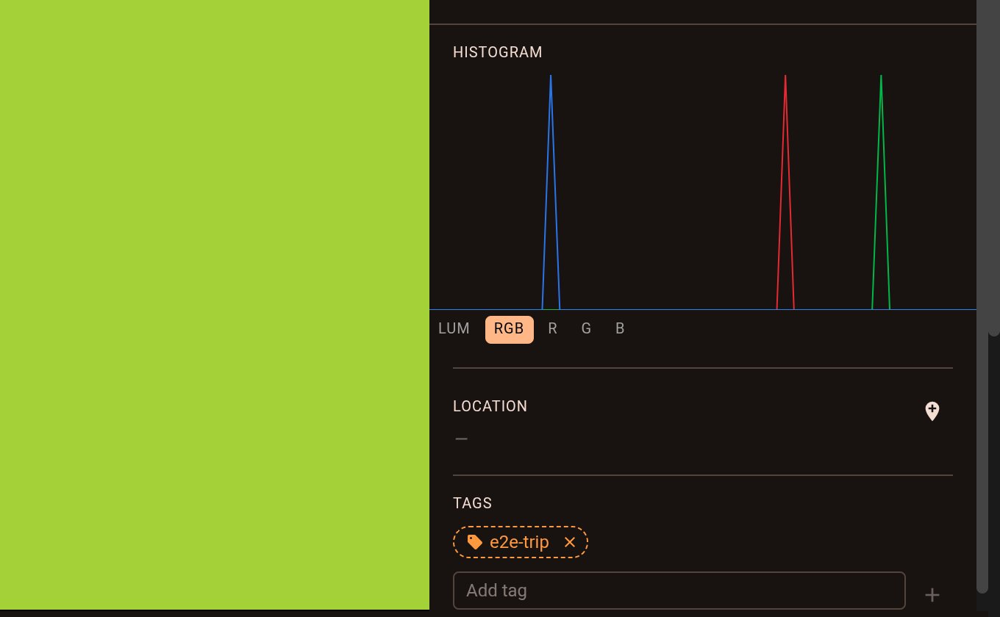
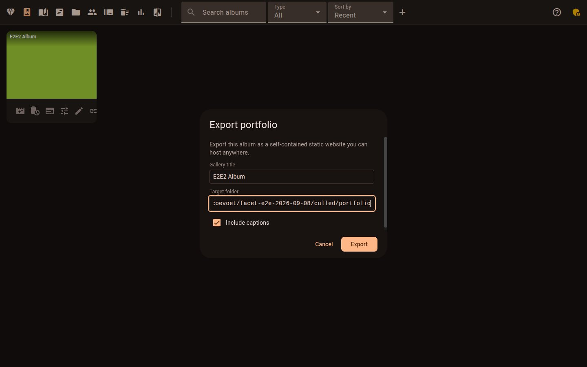

# Getting Started

> 🌐 **English** · [Français](fr/GETTING_STARTED.md) · [Deutsch](de/GETTING_STARTED.md) · [Italiano](it/GETTING_STARTED.md) · [Español](es/GETTING_STARTED.md) · [Português](pt/GETTING_STARTED.md) · [简体中文](zh/GETTING_STARTED.md)

A first-session walkthrough for the usual job: you have just shot or imported a batch of
photos and want to end up with a curated set. It follows six steps — import, group
look-alikes, teach Facet your taste, discard, tag, export — and links to the page that
explains each one rather than repeating it.


## Before you start

### 1. Set an edition password

A fresh install is **read-only**. You can browse (subject to `viewer.password`, if you set
one), but every edit — ratings, culling, faces, albums, tags and the Scan button — is
refused until you set `viewer.edition_password` in `scoring_config.json` and restart the
viewer (the config is not hot-reloaded).

With the bundled `docker-compose.yml` you do not have to invent one: the image generates a
password on first start and prints it once. Read it with:

```bash
docker compose logs facet
```

Then log in as an editor from the gallery. Details: [Single-User Mode](VIEWER.md#single-user-mode-default) and [Docker settings you can change](INSTALLATION.md#docker-settings-you-can-change).



### 2. Pick an install path

Docker is the shortest route on Windows, macOS and Linux; a native install is for people
who prefer no containers. [Which install is for me?](INSTALLATION.md#which-install-is-for-me)
has the table.

Two things trip people up with containers:

- **Config and file ownership.** The container runs as uid 1000, which rootless Podman maps
  to a host subuid, so files it creates in `./facet-config` may not be owned by your user. See
  [Container file ownership](INSTALLATION.md#container-file-ownership).
- **Paths are the container's, not the host's.** You scan `/data/photos`, not
  `~/Pictures`. See [Container Path Semantics](DEPLOYMENT.md#container-path-semantics).

### 3. No GPU? You are fine

Everything — scoring, faces, tags, culling, the Scan button — works on a processor with the
CPU `legacy` profile; it is only slower. Read
[No graphics card](INSTALLATION.md#no-graphics-card) and
[Which profile fits my hardware?](INSTALLATION.md#which-profile-fits-my-hardware). A card is
never a condition for the Scan button to appear.

### 4. Mind the memory

A container with a memory cap can be killed mid-scan on the larger profiles. Check
[Container Memory Limits](DEPLOYMENT.md#container-memory-limits) before capping one; on a
Mac see [Memory on a Mac](INSTALLATION.md#memory-on-a-mac).

## The workflow

### Step 1: Import images

Put your photos in the folder Facet is pointed at (JPEG, HEIF/HEIC, PNG and the common RAW
formats — see [supported file types](README.md#supported-file-types)) and scan it. You can
do that from the terminal ([Scanning](COMMANDS.md#scanning)) or from the browser:

- Set `viewer.features.show_scan_button` to `true` (it ships off).
- Single-user: you need an edition password **and** to be logged in as editor. Multi-user:
  you need the superadmin role.
- Add the folder to `viewer.scan_directories` so the launcher has something to pick.

A **Scan for new photos** button then sits above the gallery grid at every screen width,
not only on the empty gallery. Full rules: [Scan Trigger](VIEWER.md#scan-trigger). The first
scan downloads the AI models once ([First run](INSTALLATION.md#first-run-what-to-expect)).



### Step 2: Find duplicates, bursts and look-alikes

Facet groups burst frames, near-duplicates, exposure brackets and panoramas on its own, and
the gallery **hides most of a set by default** so you see one representative. If your
photo count looks lower than expected, that is the hide toggles, not missing files — see
[Display Options](VIEWER.md#display-options) and [Default Filters](VIEWER.md#default-filters).
To see a whole set side by side, open [Similar Photos](VIEWER.md#similar-photos) or the
[Culling](VIEWER.md#culling) darkroom; sets that must stay whole are described in
[Panoramas and exposure brackets](VIEWER.md#panoramas-and-exposure-brackets).



### Step 3: Teach Facet which one you prefer

Every pick you make while culling, and every A/B choice in comparison mode, is a signal.
Facet learns a personal ranking from them and exposes it as **My Taste**
([My Taste](VIEWER.md#my-taste)). Choose "this one beats that one" in
[Pairwise Comparison Mode](VIEWER.md#pairwise-comparison-mode), or simply cull — the
[Culling](VIEWER.md#culling) screen records your keeps and rejects. The ranker retrains on
its own after enough new choices, and only once you pause
([Auto-retrain](CONFIGURATION.md#auto-retrain)).



### Step 4: Discard what you do not want

Reject photos while culling, or select a set and act on it
([Multi-Select & Bulk Actions](VIEWER.md#multi-select--bulk-actions)):
[Keep Top N%](VIEWER.md#keep-top-n), [Cull to folder](VIEWER.md#cull-to-folder) or
[Delete](VIEWER.md#delete). Cull to folder previews as a dry run until you apply it. Delete sends files to
the OS trash at once, and only when `viewer.cull.allow_trash` is on (it ships `false`).
[Undo](VIEWER.md#undo) covers batch flag changes and culling confirms, not these file
operations. The folders a cull may write to are an allow-list: your scan directories
plus `viewer.export.allowed_target_dirs`, so a subfolder of the photo tree works with no
setup, while a folder outside it is refused until you add it. See
[Export and cull destinations](CONFIGURATION.md#export-and-cull-destinations). To cull
headlessly: [Cull a Shoot from the Terminal](COMMANDS.md#cull-a-shoot-from-the-terminal).

Photos you delete outside Facet leave their database row behind until you run the cleanup in
[Database Maintenance](COMMANDS.md#database-maintenance).



### Step 5: Add tags and metadata to the keepers

Facet tags photos automatically, and you can add **your own tags** too: in the photo detail
view for one photo, or from the bulk actions for a selection. Manual tags survive rescans,
the tag filter and search find them, and they are hidden from share links. Foreign XMP
sidecar keywords are imported as manual tags; removing a tag in Facet does not remove it
from sidecars Facet already wrote. See [Manual tags](VIEWER.md#manual-tags) and
[Manual tags and XMP keywords](INTEROP.md#manual-tags-and-xmp-keywords). To carry ratings
and keywords into Lightroom, Capture One, digiKam or darktable, see [Interop](INTEROP.md)
(this needs [exiftool](INSTALLATION.md#exiftool) for embedding).



### Step 6: Export the curated set

Put your keepers in an album and export from there, or use
[Editor Export](VIEWER.md#editor-export) for a hand-off to an editor, or
[Cull to folder](VIEWER.md#cull-to-folder) to copy the keepers into a folder. The
same destination allow-list as in step 4 applies
([Export and cull destinations](CONFIGURATION.md#export-and-cull-destinations)).



## Where next

[Viewer](VIEWER.md) for every gallery feature, [Commands](COMMANDS.md) for the terminal,
[Scoring](SCORING.md) to tune what counts as a good photo, and
[Deployment](DEPLOYMENT.md) for a NAS or a shared server.
